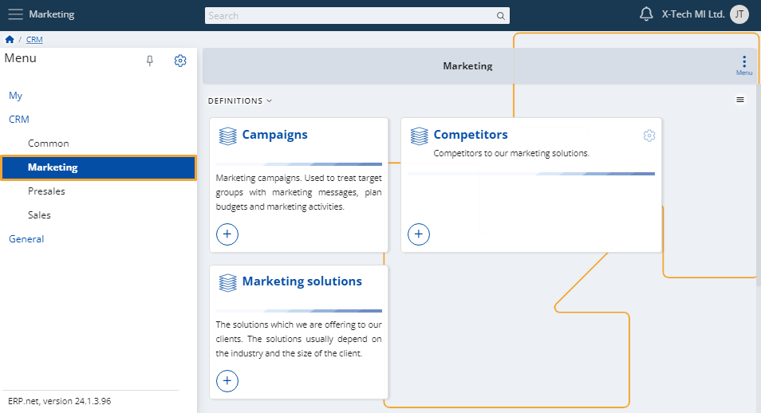
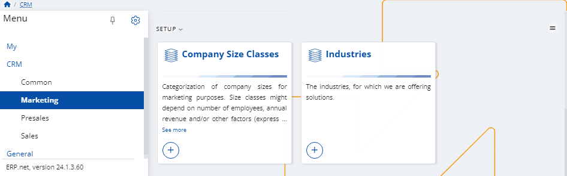
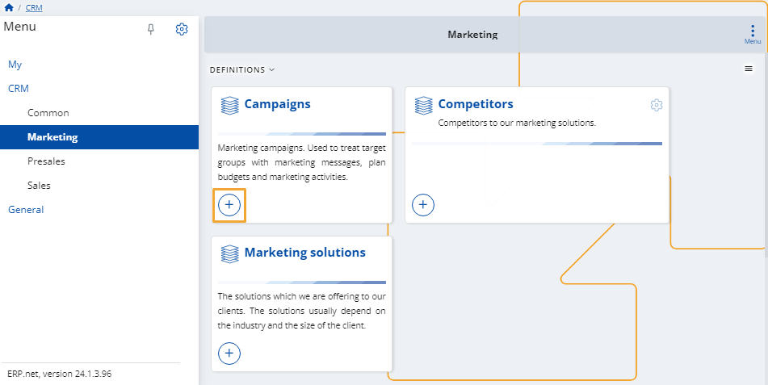
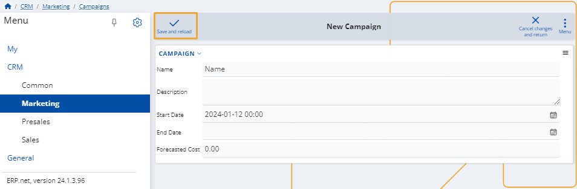
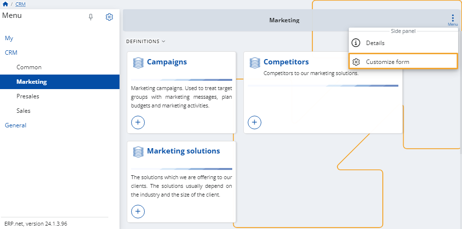
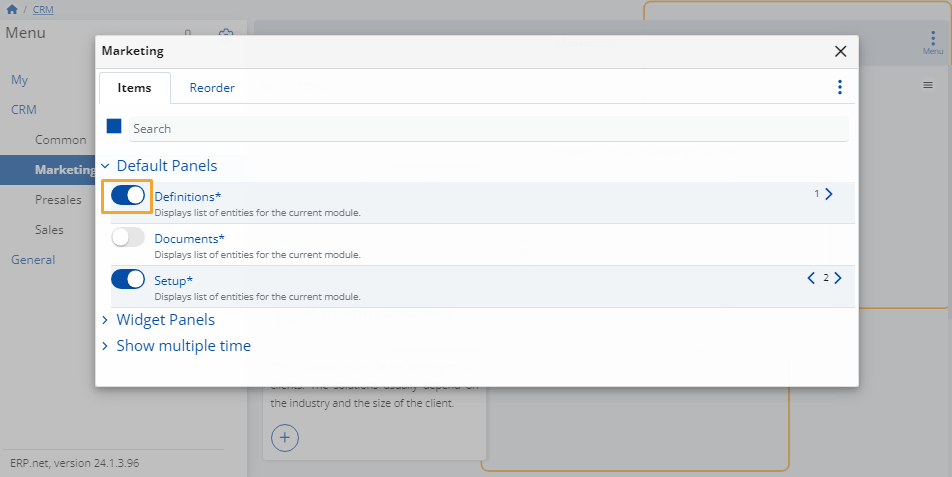
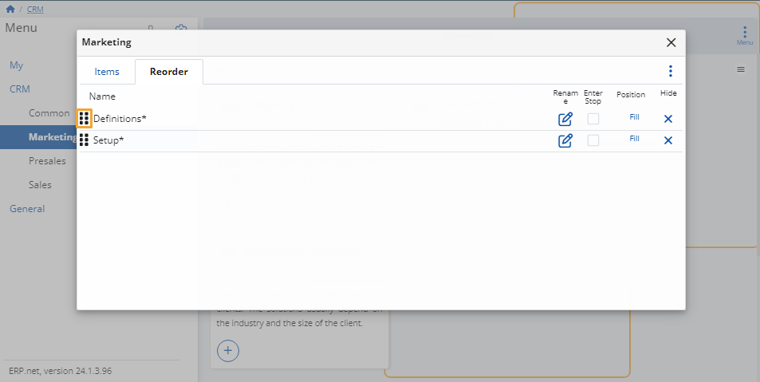

# Marketing

This module allows you to preview your **campaigns**, **competitors**, and **marketing solutions**.

You can also create new ones on-demand, or remove existing entities which are no longer needed.

The module features the ability to set up **company size classes** and **industries**.

These may be useful for different definitions.

### Add new

To create a new campaign, competitor or marketing solution, simply click on its **+ button**.

This will open the respective **creation form** that you need to fill.

Once ready, click the **Save and reload** button to finish adding the new entry.

### Customize form

You can decide which definitions appear on the page.

To do that, click the **button** at the top-right corner and select **Customize form**.

In the window that opens, you will see two tabs:

* **Items**

  Click the **sliders** on the left of an item to hide or reveal the respective panel from the page.

  

* **Reorder**

  You can change the order of the **items' categories** by dragging them up and down.

    
