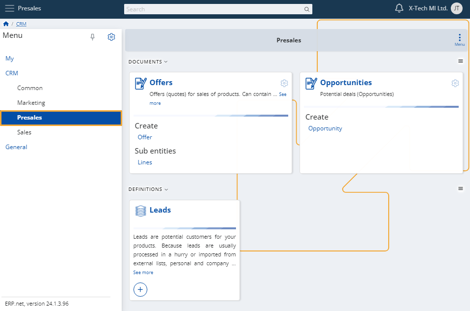
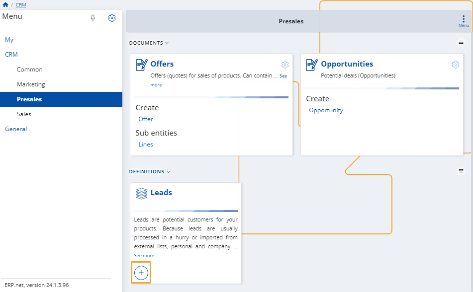
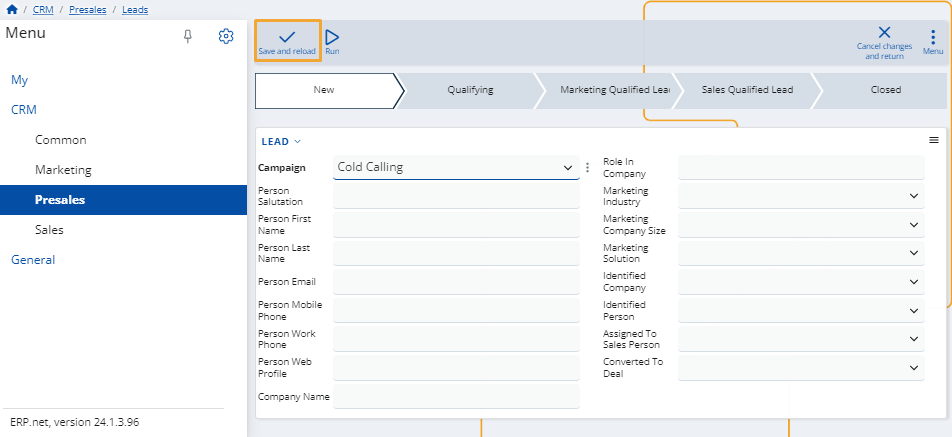
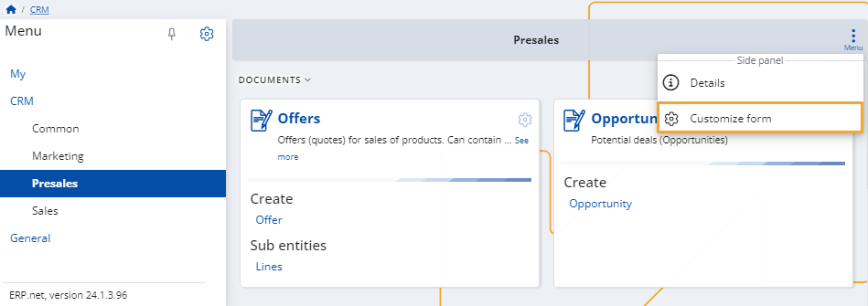
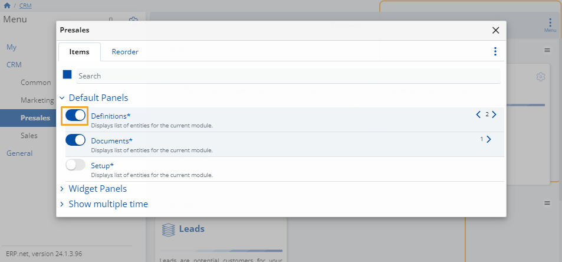
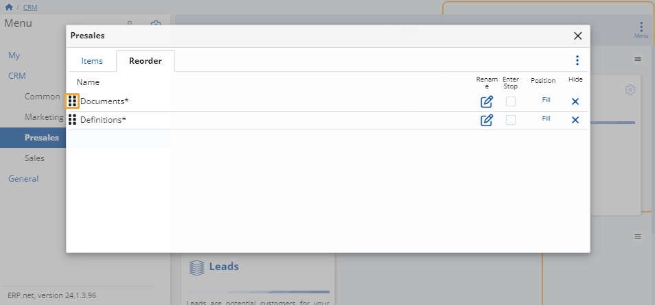

# Presales

This module allows you to monitor your **leads**, identify potential **opportunities**, and create **offers** for sales of products.

It includes both definitions and documents as part of its structure.

### Add new

To create a new lead, offer or opportunity, simply click on its **+ button**.

This will open the respective **creation form** that you need to fill.

Once ready, click the **Save and reload** button to finish adding the new entry.

### Customize form

You can decide which definitions appear on the page.

To do that, click the **button** at the top-right corner and select **Customize form**.

In the window that opens, you will see two tabs:

* **Items**

  Click the **sliders** on the left of an item to hide or reveal the respective panel from the page.

  

* **Reorder**

  You can change the order of the **items' categories** by dragging them up and down.

  

> [!NOTE]
> The screenshots taken for this article are from v24 of the **Web Client**.
