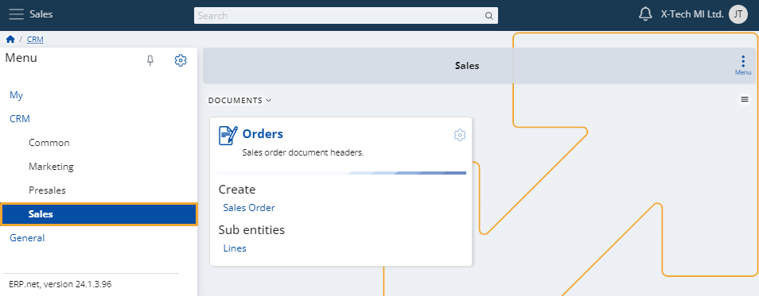
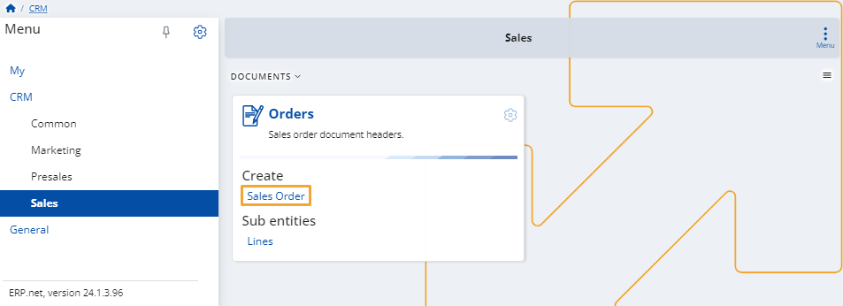

# Sales

This section allows you to create new **sales orders** and **lines**.

It also features the ability to preview all sales orders that your company has made.

### Add new

To create a new sales order, click the respective **Sales Order** button.

You need to fill the **creation form** with data essential for the order.

Once ready, click the **Save and reload** button.

[Express](pictures/Sales_save.png)

> [!NOTE]
> The screenshots taken for this article are from v24 of the **Web Client**.
