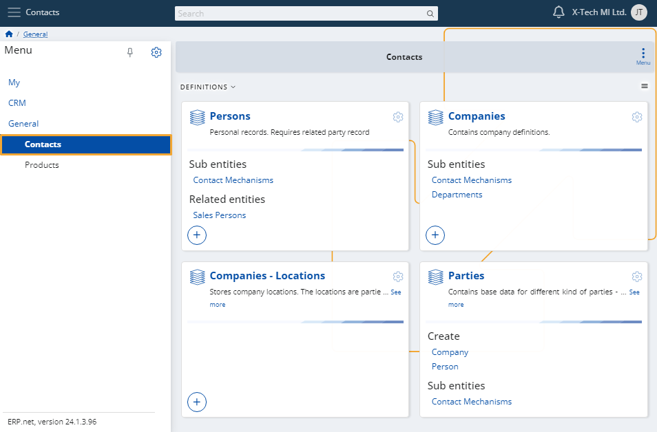
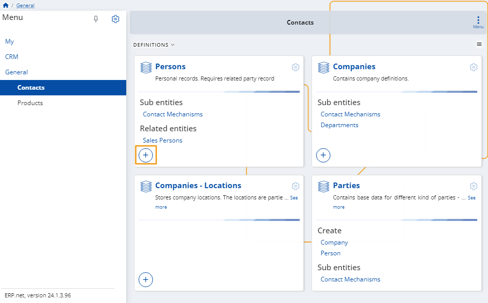
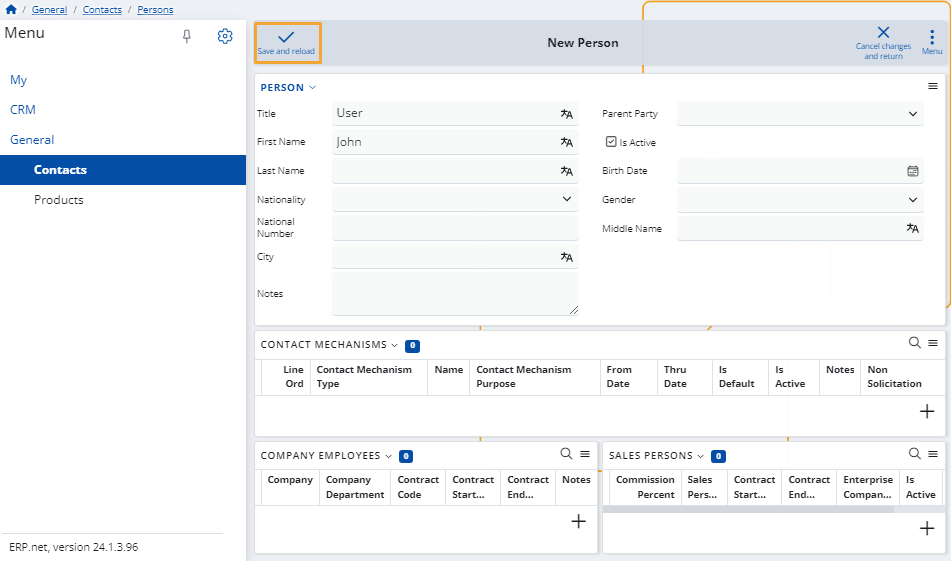
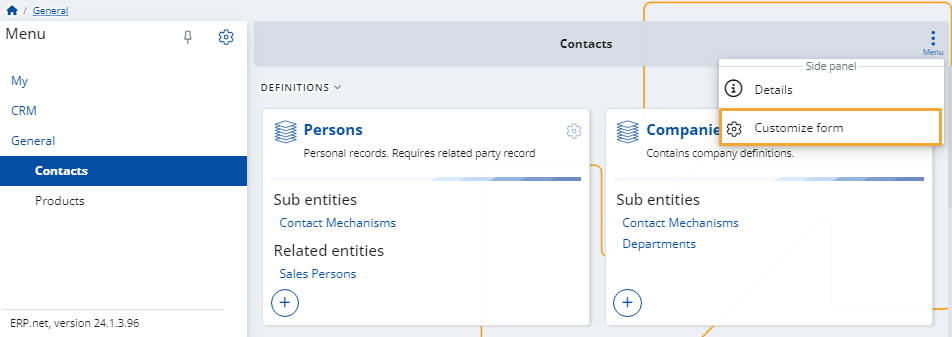
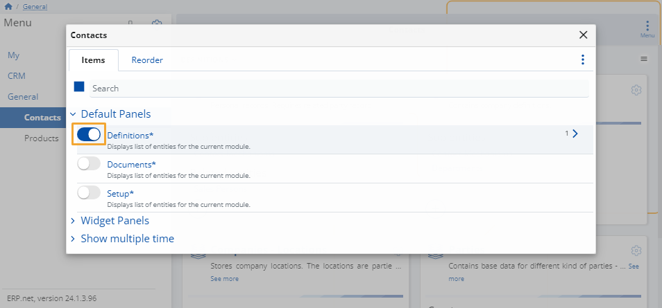

# Contacts

In this module, you can manage people (**persons**), **companies** and their **locations**, as well as different kinds of **parties**.

These are all the company and business-related relationship entities which you can define on-demand.

### Add new

To create a new person, company or location, simply click on its **+ button**. 

This will open the respective **creation form** that you need to fill.

Once ready, click the **Save and reload** button to finish adding the new entry.

### Customize form

You can decide which definitions appear on the page.

To do that, click the **button** at the top-right corner and select **Customize form**.

In the window that opens, you will see two tabs:

* **Items**

  Click the **sliders** on the left of an item to hide or reveal the respective panel from the page.

  

* **Reorder**

  You can change the order of the **items' categories** by dragging them up and down.

  This would not be applicable if there's only one item category (e.g. Definitions).
