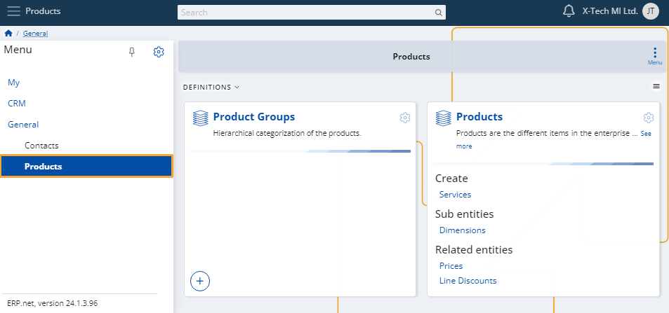
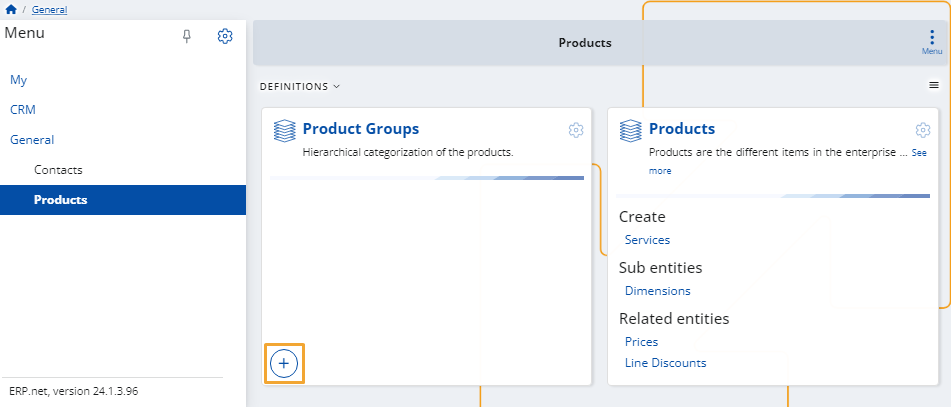
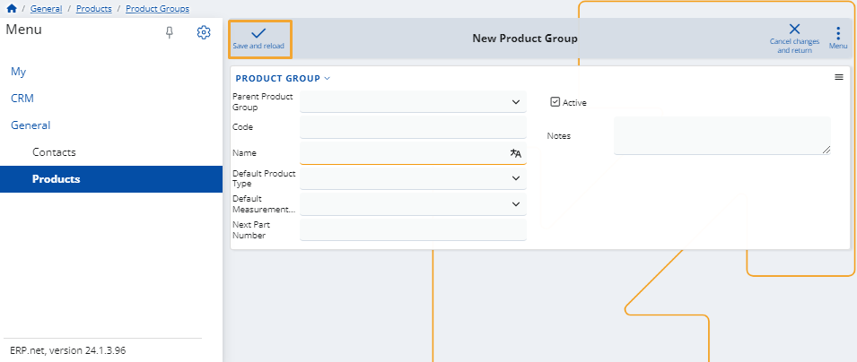
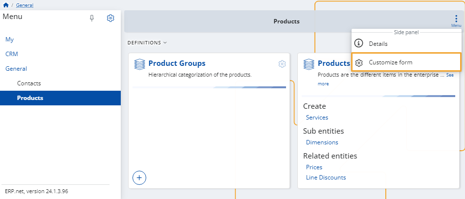
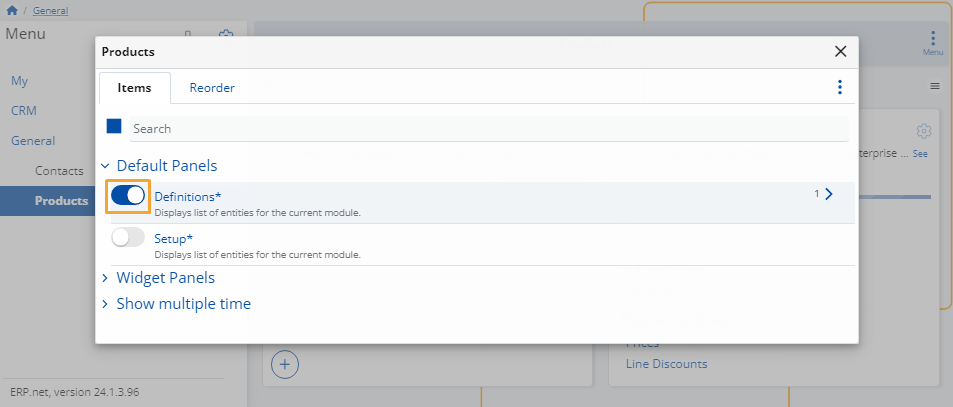

# Products

In this module, you can find all of your **products** and their **product groups**.

It also allows you to define and manage these entities on-demand.

### Add new

To create a new product, simply click on its **+ button**.

This will open the creation form that you need to fill.

Once ready, click the **Save and reload** button to finish adding the new product.

### Customize form

You can decide which definitions appear on the page.

To do that, click the **button** at the top-right corner and select **Customize form**.

In the window that opens, you will see two tabs:

* **Items**

  Click the **sliders** on the left of an item to hide or reveal the respective panel from the page.

  

* **Reorder**

  You can change the order of the **items' categories** by dragging them up and down.

  This would not be applicable if there's only one item category (e.g. Definitions).

> [!NOTE]
> The screenshots taken for this article are from v24 of the **Web Client**.
