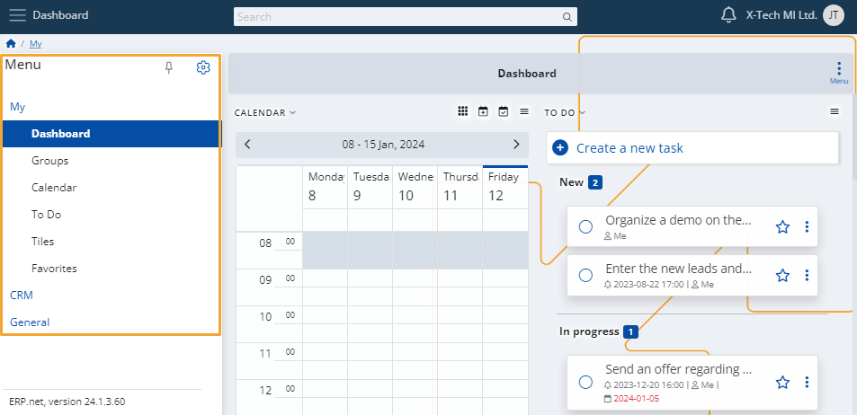

# Express

Express is a module which seamlessly unites team collaboration with business operations, allowing you to increase your productivity and achieve better workflow organization. 

Its intuitive interface and flexible customization capabilities can be used on-demand, as soon as the need for a meeting to be scheduled or a task to be set arises. 

## Navigation

You can take advantage of several core functionalities in order to better navigate the Express system. 
 
### Search bar 

Use it to locate specific panels or document creation forms belonging to one or more menu elements. 

For example, if you want to create a product group, instead of using the menu to find it, simply write what you need in the search bar.

### Notifications 

When something related to the system or a favorite item occurs, you will receive a notification for it. 

Click the **bell icon** at the top-right corner to learn what happened.

### Menu 

Click the button at the top-left corner of the page to expand the main menu. 

Express consists of three main modules which are further divided into sub-modules. 

•	**My**

•	**CRM**

•	**General**

