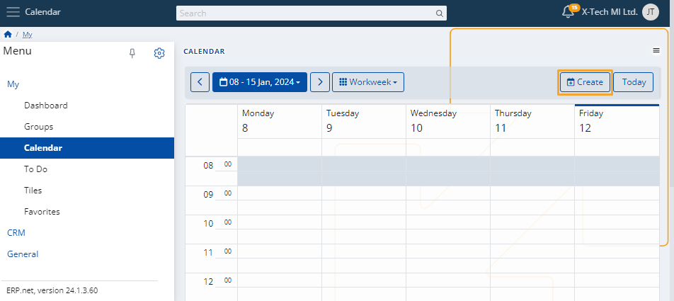

# Calendar

This is a personal environment which contains all individual events or tasks you've scheduled for yourself. 

Furthermore, it includes group activities from all the social groups you're participating in. 

Such events will appear in your calendar as long as you’re set as a responsible person, organizer, or participant in a group activity.

Within the Calendar, you can:

* **create** a new event
  
* change the **view** in which all events appear (Workweek, Month)

* **navigate** to past or future dates

* **access** any of your scheduled personal or group events.

### Time period

To change the view of the Calendar, use the **dropdown menu** on the right and select either "Month" or "Workweek". 

To get to specific weeks or months, use the **left** and **right** **arrows**.

Depending on the view, you can also select a specific **week** or **month** from the blue-colored navigator.

### Create an event

To add a new event to the Calendar, use the **Create** button.

You’ll be taken to a separate page where you need to fill necessary **information** about the activity and the potential **participants** in it.

When ready, click **Save and reload**, and the activity will be added to your Calendar. 

> [!NOTE]
> The screenshots taken for this article are from v24 of the platform.
