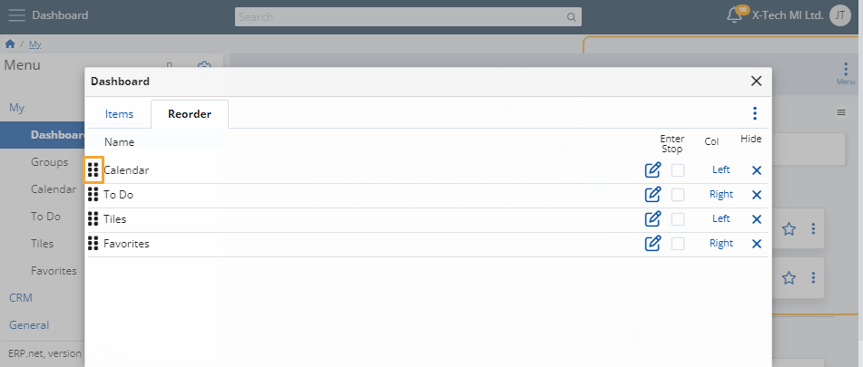

# Dashboard

The Dashboard allows you to build a space in accordance with your preferences by adding, removing, or rearranging panels as needed. 

It's entirely **customizable**, giving you the freedom to prioritize what matters most to you, without any mandatory elements. 

It includes easy access to panels from sub-modules such as **Chat**, **Tiles**, **To Do** and **Calendar**, as well as many other items you can choose to additionally add into it.

### Customize

To determine what goes into the Dashboard and where, click on the **button** at the top-right corner of the page and select **Customize form**. 

In the window that opens, you'll find two tabs: 

* **Items**

  Click on the **sliders** to show or hide widget panels in your Dashboard.

  

* **Reorder**

  Change the order in which widgets appear on the Dashboard by **dragging** them up and down.

    
