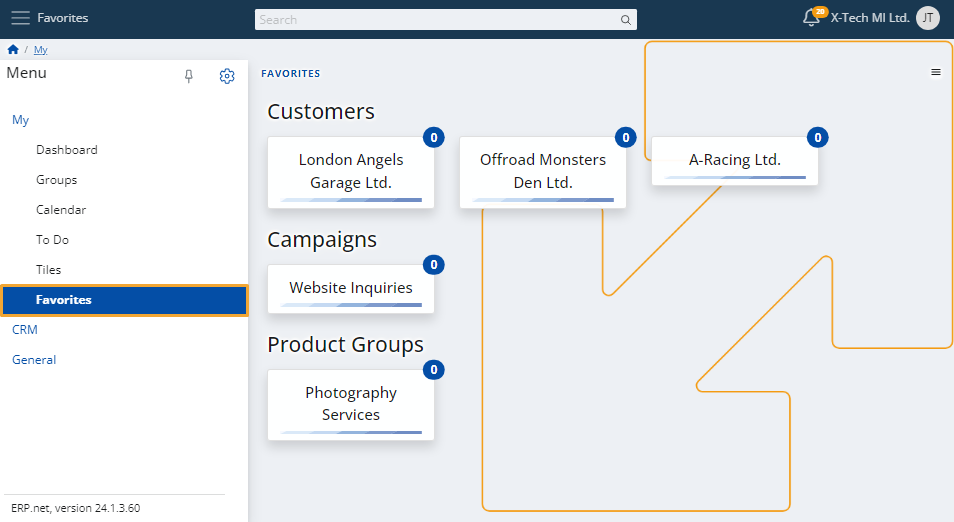

# Favorites

You can build your own list of **favorites** by adding different items of interest. 

This includes the compaines, produts or any other entities that you follow. 

Once they’re marked as favorite, you will receive **notifications** for relevant events that happen to them. 

If you mark a specific document as a favorite, it automatically includes **all** of its related documents.

This way, you can stay informed about important actions others may take on the documents.

### Add a favorite

To add a new item to your favorites, simply click on its **star button** at the top-right corner.

This could be any customer, document, campaign, lead, and much more.

### Edit

To limit the number of favorite items you have, click the **button** at the top-right corner of the page and select **Edit**.

Click on a **red cross** at the top-right corner of a favorite to **remove** it. 

You'll be asked to confirm the action.

