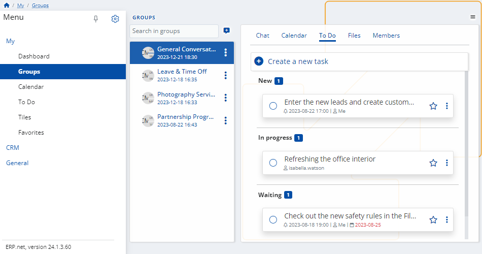
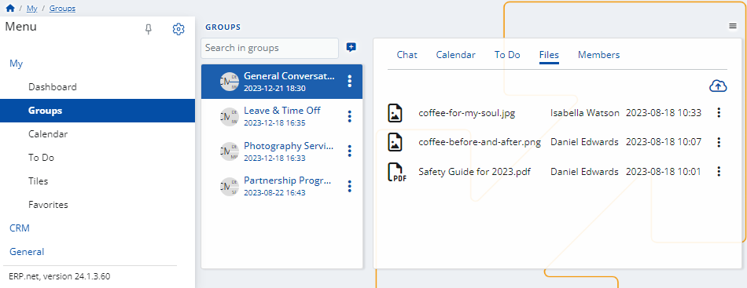
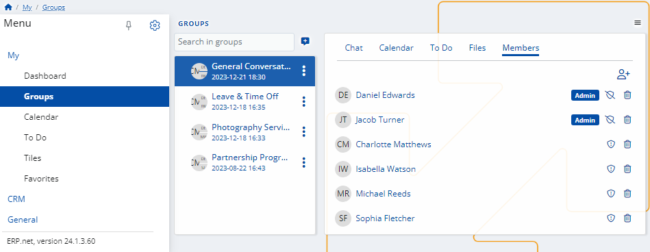

# Groups

This module contains all the social groups you're involved in. 

Each is equipped with a range of productivity tools designed to enhance teamwork between members.

Within a group, you can find the following features:

### Chat

Engage in instant communication with colleagues belonging to the same group. 

The group **Chat** allows you to text, react to messages, and import images.

### Calendar

This is a shared environment which includes **scheduled events** and **tasks** belonging to colleagues within the group. 

You can create new events for yourself and others, and change the view of the group Calendar directly from here.

### To Do

All group members’ tasks are kept in this panel. 

You can create new To Dos for the group, as well as see which of them are **New**, **In progress**, **Waiting** or **Completed**.

### Files

Access to different **files** related to the group is granted here. 

You can **add** new files to share them with your team, or **delete** them if they’re no longer needed.

### Members

Here, you can see the membership status of each group participant, as well as access their personal profiles. 

Admins can **add** or **remove** team members on-demand. 

