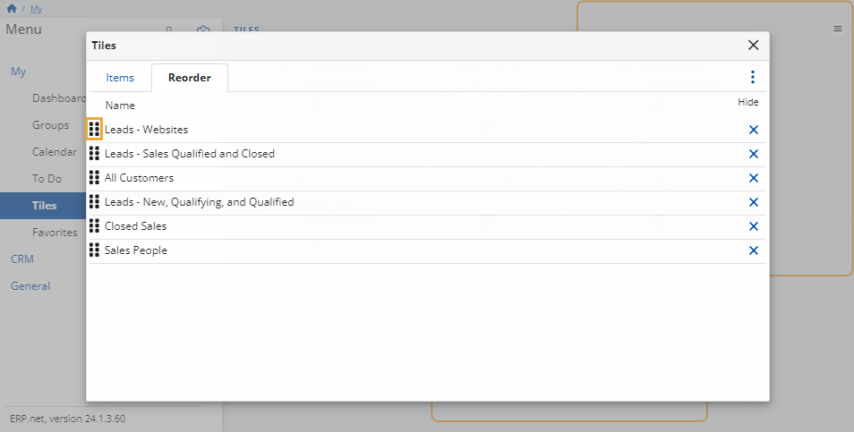

# Tiles

This module features useful **statistics** on some of your business activities.

It allows for additional **customization** to better fit your business needs. 

## Tile actions

Click the **button** the top-right corner of the page in order to **Edit**, **Reload** or **Customize** **the view** of this page.

### Edit

This action allows you to **remove** a tile by clicking on the **red cross button** at its top-right corner.

You'll be asked to confirm the action.

### Reload

This action **refreshes** the information on the tiles so that the most up-to-date data is displayed.

### Customize view

This action allows you to **reveal** or **hide** tiles from the page, as well as change their **order**.

It opens a separate window with two tabs:

* **Items**

  Click on the **sliders** next to an item to add or limit access to the respective tile.

  

* **Reorder**

  Change the order in which tiles appear by **dragging** them up and down.

  

> [!NOTE]
> The screenshots taken for this article are from v24 of the **Web Client**.
