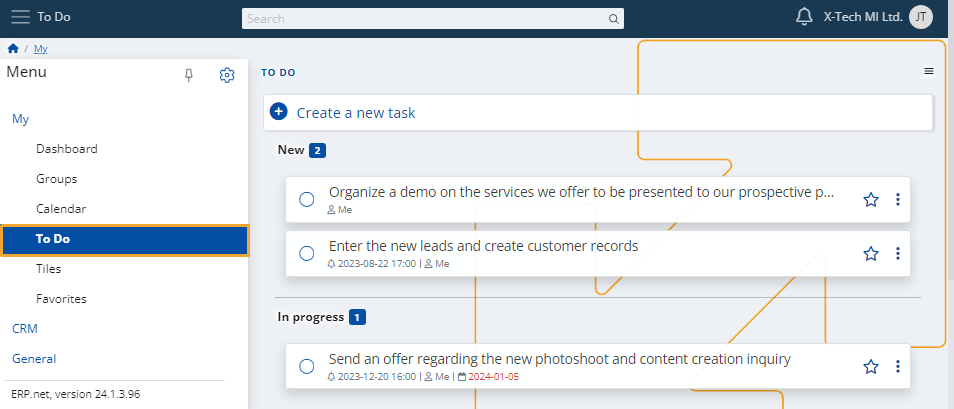
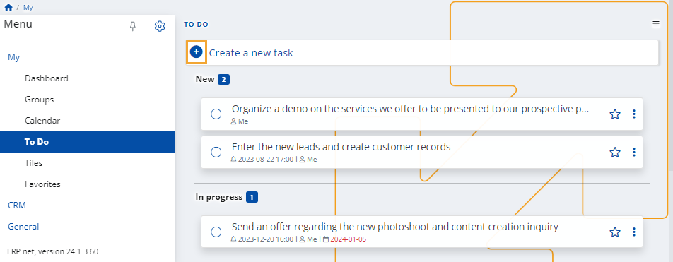

# To Do

Within this module, you have the ability to create **personal tasks**. 

These can be useful for reminders or meetings, allowing you to stay in touch with everything related to your work. 

Depending on their completion status, tasks are categorized as **New**, **In Progress**, and **Completed**.

When creating a task within a social group, you also have the ability to assign it to **another member** of that group.

### Create a task

To begin adding a new task, click the circular **+ button**.

You can include both a **reminder** and a **due date** for the task.

To finish adding your task, click the **Create** button. 

It will be placed in the **New** category.

### Complete a task

To complete a task, click on the **circular button** on its left to mark it as done. 

It will be placed in the **Completed** category.

