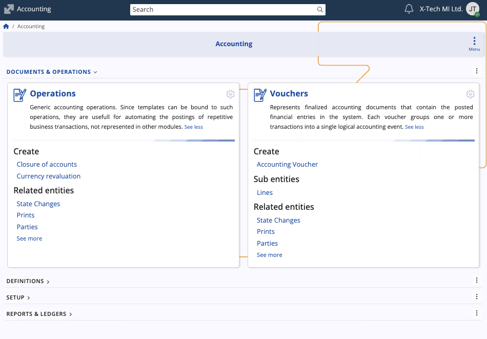
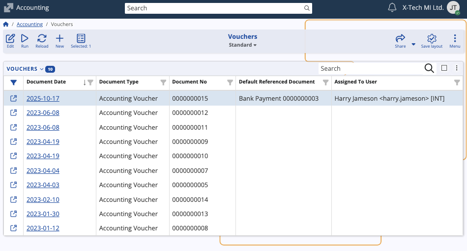
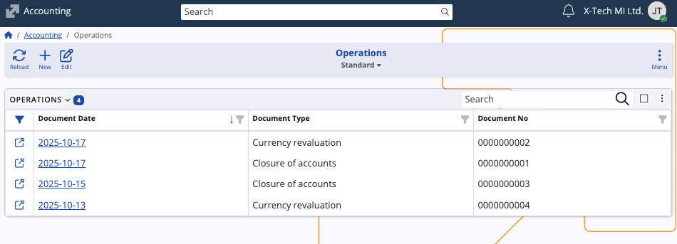
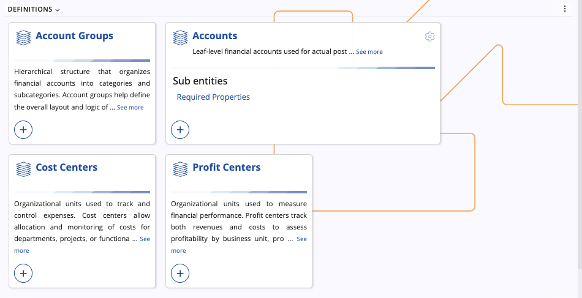
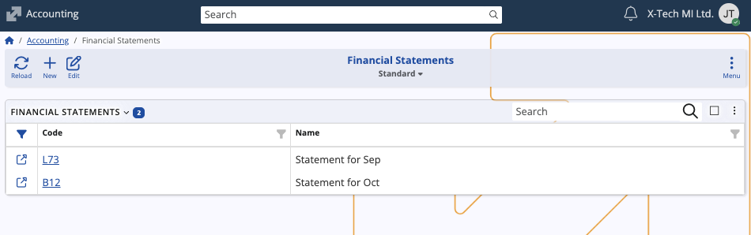
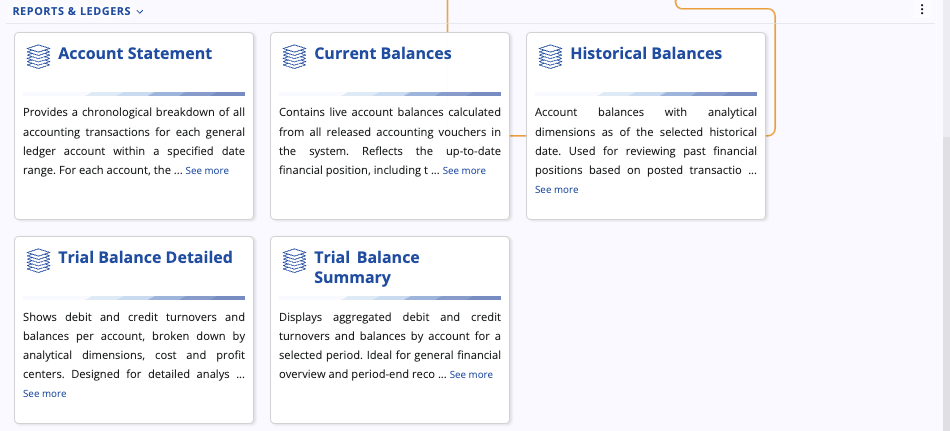

# Accounting

Accounting is an integral component of the **[Finance module](../index.md)**. Its primary purpose is to establish an auditable, rule-based environment for recording, summarizing, and presenting the financial position of an organization. 

This submodule integrates foundational definitions with operational documents and provides the necessary reports, like trial balances and financial statements, for both internal management and statutory compliance.

## Interface

Accounting is segmented into three primary areas: 

### Documents & Operations

These components represent the actual financial events recorded in the system.

#### Vouchers

Represents transactional accounting documents that have been finalized and posted, serving as the official record for general ledger entries. They can reference a default document that initiated the voucher creation.

#### **[Operations](https://docs.erp.net/tech/modules/financials/accounting/operations/index.html)**

Represents system-level accounting processes or non-standard adjustments executed via specific documents. These transactions are typically automated or periodic procedures.

### Definitions 

These components establish the structural foundation and rules of the accounting system.

#### Accounts

The leaf-level financial accounts used for actual posting (the core of the chart of accounts).

#### Account Groups

A hierarchical structure used to organize individual accounts into categories and subcategories, defining the overall layout and logic of the chart of accounts.

#### Cost Centers

Organizational units used to track and control expenses, allowing allocation and monitoring of costs for specific departments, projects, or functions.

#### Profit Centers

Organizational units used to measure financial performance by tracking both revenues and costs, assessing profitability by business unit, product, or project.

### Financial Statements (SETUP)

Defines user-created financial statement reports (e.g., Balance Sheet, Income Statement).

### Reports & Ledgers

These components provide the mechanisms for querying, analyzing, and summarizing the transactional data.

#### Account Statement

Provides a chronological breakdown of all accounting transactions for a specific ledger account within a specified date range.

#### Current Balances

Contains live account balances calculated from all released accounting vouchers, reflecting the up-to-date financial position.

#### Historical Balances

Shows account balances with analytical dimensions as of a selected historical date, used for reviewing past financial positions.

#### Trial Balance Detailed

Shows debt and credit turnovers and balances per account, broken down by analytical dimensions (e.g., Cost and Profit Centers), designed for detailed analysis.

#### Trial Balance Summary

Displays aggregated debt and credit turnovers and balances by account for a selected period, ideal for general financial overview and period-end reconciliation.

> [!NOTE]
>
> The screenshots taken for this article are from v.26 of the platform.

