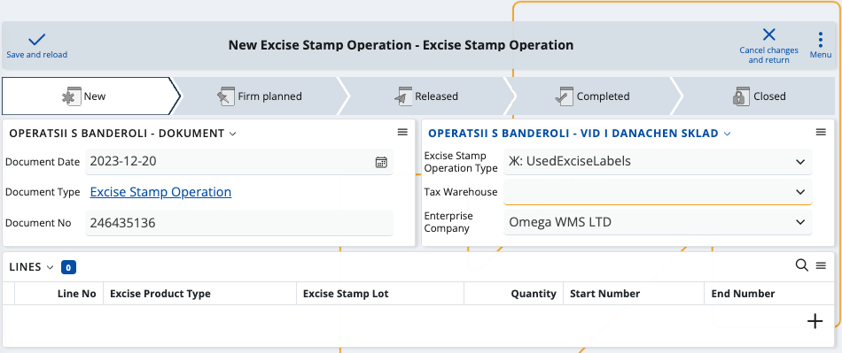

# Excise

According to EU legislation, certain products like alcoholic beverages, beer and cigarettes are subject to **excise tax** whenever they are imported into a warehouse. This one-time fee is also due if the warehouse itself manufactures the products.

The **Excise** module is designed to assist businesses in meeting their legal duties to regional custom agencies or other institutions requiring excise taxes. Using its resources, you can create and generate all the necessary **[documents](documents/index.md)** and **[definitions](definitions/index.md)** related to your excise payments. At the end of each month, they are all included in a final **excise declaration**.

> [!NOTE]
> The EU Excise legislation is applicable to all member states and affects all excise products, but there are regional differences in how documents are filled and submitted. For example, since Excise can currently be used in Bulgaria, it is legally obligated to feature alcoholic drinks as excise-taxable products. Product categories outside of this scope are **not** taxed.

## Overview

The main process flow in Excise goes like this:

> *Tax Warehouse* → *Issue/Receipt Transactions* → *Excise Stamp Operation* → *Excise Declaration*

## Tax warehouse

To use this module, you first need to define a digital **tax warehouse**. 

Its purpose is to store all of your manufactured and imported products which are registered under the common Excise law.

It requires a name and special **numbers** for validation, provided by your customs agency.

> [!NOTE]
> Tax warehouses are **not** tied to a physical location. They are completely **digital** and you can link them to any or all of your existing warehouses, which unites them under one common environment.

## Issue/Receipt transactions

Owning a tax warehouse obligates you to generate **transaction documents** for everything that happens to your excise products.

By law, these documents must be exported and sent over to the customs office and/or your regional tax-collecting agency.

**Example:**

- If a product enters your tax warehouse, **receipt** transactions need to be created to reflect the excise tax for this operation. 

- If a product is sold or leaves your tax warehouse for another, generating the respective **issue** transactions will be necessary. 

When products are imported from or exported to another tax warehouse, the **electronic administrative document (e-AD)** allows you to report each transaction. If operations are limited to your tax warehouse, you must fill an **electronic excise tax document (e-ETD)** instead.

### Definitions

You can take advantage of a variety of **system** and **custom** definitions. 

Excise allows you to both use and create new excise product [types](definitions/excise-products.md), [categories](definitions/excise-categories.md), and [other entities](definitions/other-excise-definitions.md) required for transaction documents.

> [!NOTE]
> Some excise-related definitions are auto-generated while others need to be manually set-up. It is **not possible** to submit a document without defining a **product type** for all of your excise products.

Once you fill a transaction document, you must export it as an **XML file** and send it to your taxing authority and/or customs office. 

## Excise stamp operations

When excise products are manufactured, imported or exported from a tax warehouse, they need to have a **stamp** placed on them.

In the case of alcoholic beverages, for example, every bottle must have a **banderol stamp**. 

You can create new banderol stamps and relate them to specific **operation types** such as:

- Received from the customs (ReceivedExciseLabels)
- Placed on the bottles within the tax warehouse (UsedExciseLabels)
- Returned and unused (ReturnedUnusedExciseLabels)

In most cases, banderol stamps are provided by the customs office and placed on every bottle of alcohol.

Reporting all the stamps you have used is a **compulsory section** of the final excise declaration.

> [!NOTE]
> Banderol stamps have unique serial numbers, emission and date of placement. When creating a banderol report, you generate another **transaction document** which includes the excise operation type, related products and number of used stamps. It is possible for fewer stamps to be placed than originally received.

## Excise declaration

As a legal requirement, **all** of your monthly transactions are automatically included in a final **excise declaration**.

It unites the transaction documents you have reported for the month, summarizes your product availability and excise payments, and includes a banderol stamping report.

> [!NOTE]
> Customs offices may have the legal right to also electronically scan the movements of products in and out of your tax warehouse. Additional **transactions** will be generated for each operation and are automatically included in the final excise declaration.

A typical excise declaration has the following sections:

1. Excise amount owed and paid for each issue/receipt transaction within the tax warehouse
2. Past and current availability of each excise product in the tax warehouse, including incomes and expenses 
3. Banderol stamping report covering each banderol operation

At any time, you can **visualize** this declaration and correct any mistakes before officially submitting. 

When ready, you need to export it as an **XML** file and send it to the respective taxing authority.

> [!NOTE]
> Customs or other taxing authorities may need **direct access** to your ERP.net system in order to observe your tax warehouse. In the case of Bulgarian clients, for example, there's a **[separate environment](https://testdb-model.my.erp.net/legal)** offering the ability for custom agencies to generate reports and see which products are available in a tax warehouse for a specific period of time.

### Post-excise

If your declaration meets all legal requirements, the excise tax is **settled** and products can be moved freely from one store to another.

Learn more about Excise in the following articles:

- **[Definitions](definitions/index.md)**
- **[Documents](documents/index.md)**
- **[Country specific](country-specific/index.md)**

