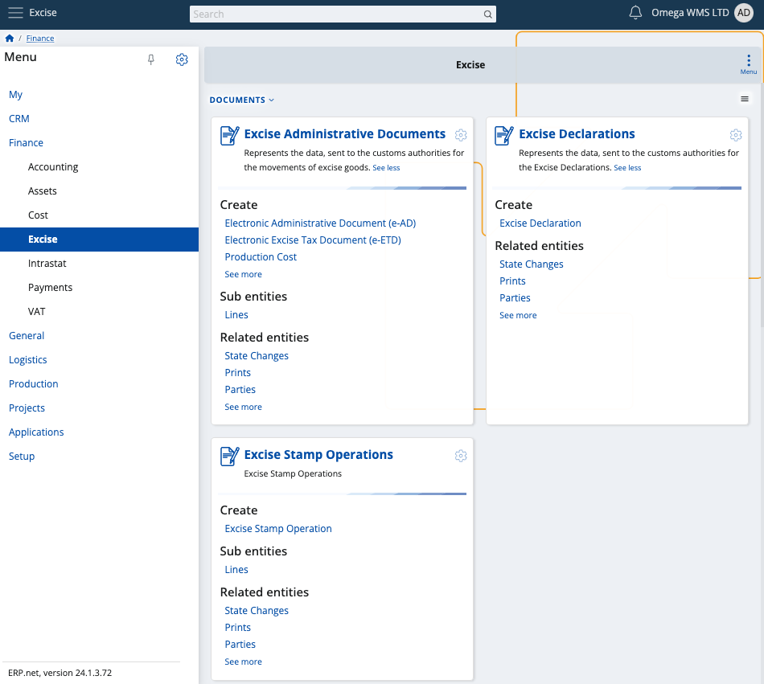
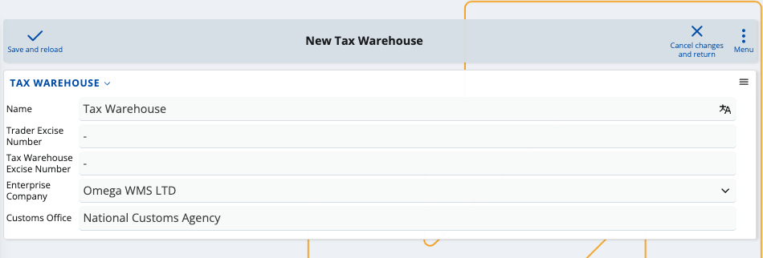
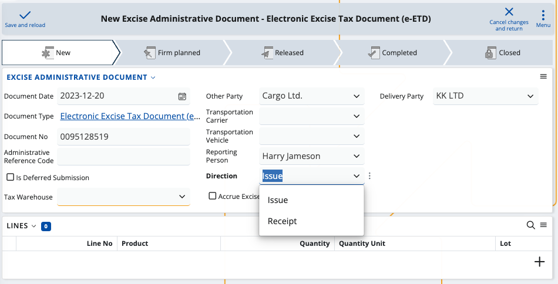
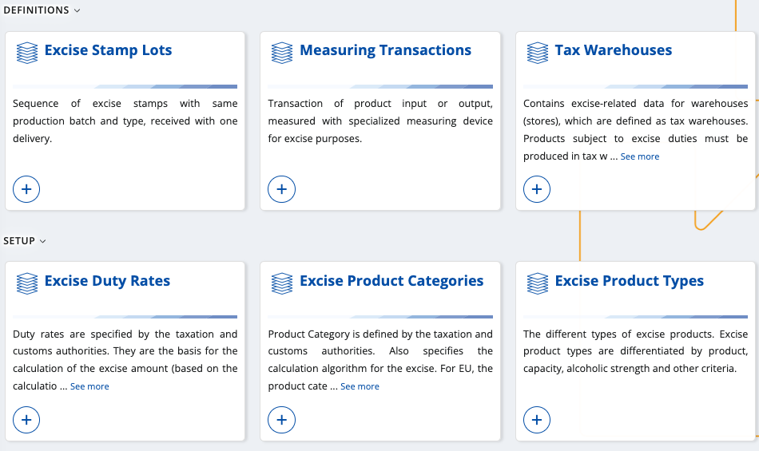
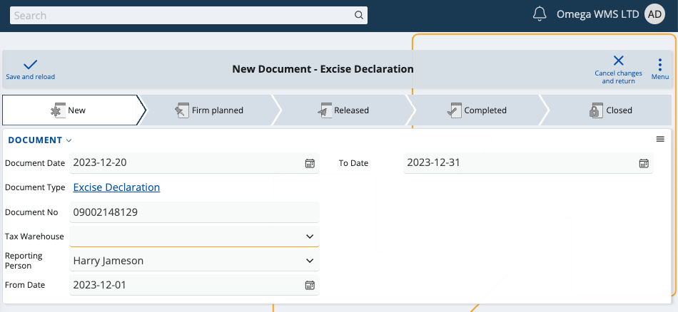
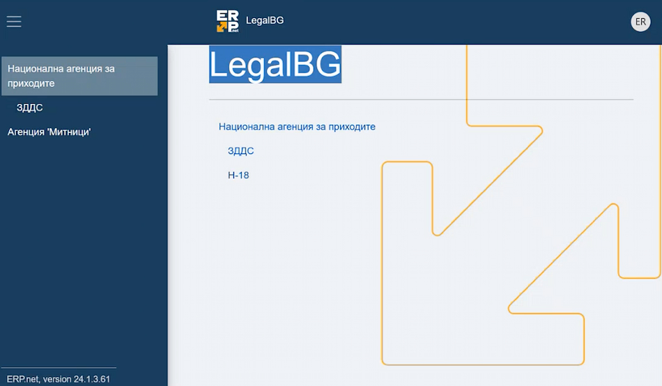

# Excise

According to EU legislation, certain products like alcohol and cigarettes are subject to **excise tax** whenever they are imported into a warehouse. This one-time fee is also due if the warehouse itself manufactures the products.

The **Excise** module is designed to assist businesses in meeting their legal duties to regional custom agencies or other institutions requiring excise taxes. Using its resources, you can create and generate all the necessary **documents** and **[definitions](definitions/index.md)** related to your excise payments. At the end of each month, they are all included in a final **excise declaration**.

> [!NOTE]
> The EU Excise legislation is applicable to all member states and affects all excise products, but there are regional differences in how documents are filled and submitted. For example, since Excise can currently be used in Bulgaria, it is legally obligated to feature alcoholic drinks as excise-taxable products. Categories outside of this scope are **not** taxed.

## Overview

The main process flow in Excise goes like this:

> *Tax Warehouse* → *Issue/Receipt Transactions* → *Banderol Stamp Report* → *Excise Declaration*

### Tax warehouse

To use this module, you first need to define a digital **tax warehouse**. 

Its purpose is to store all manufactured or imported products which are registered under the common Excise law.

> [!NOTE]
> Tax warehouses require special **codes** provided by your customs agency and are **not** tied to a physical location. They are completely **digital** and you can link them to any or all of your existing warehouses, which unites them under one common environment.

### Issue/Receipt transactions

Owning such a warehouse obligates you to generate **transaction documents** for all movements of all excise products. 

By law, these documents must be exported and sent over to the customs office and/or your regional tax-collecting agency.

**For example:**

If a product enters your tax warehouse, a **receipt** transaction needs to be created to reflect the excise tax payment for this operation. 

If the product leaves your tax warehouse either to be sold or moved to another store, generating an **issue** transaction will be necessary. 

In these cases, filling out an **electronic administrative document** allows you to report the respective transaction. Some of the data will be provided by the customs agency. Excise is equipped with other templates and definitions for most day-to-day scenarios. 

#### Definitions

You can take advantage of a variety of **system** and **custom** definitions. Excise allows you to both use and create new excise product types and categories, purpose codes, duty rates and many other entities required for transaction documents.

> [!NOTE]
> Some excise-related definitions are auto-generated while others like product type and capacity need to be manually set-up. It is **not possible** to submit a document without specifying a product type for all of your excise products.

### Banderol stamp report

## Excise declaration

Once filled, a transaction document must be exported as an **XML file** and sent to the relevant taxing authority and/or customs office. Unless otherwise stated, **all** of your monthly transactions are automatically included in a final **excise declaration** that you must also export and send.

This document unites the product operations you have reported for the month and further delivers summarized information.

> [!NOTE]
> Customs offices may have the legal right to also electronically scan the movements of products in and out of your tax warehouse. Additional **transactions** will be generated for each operation and are automatically included in the final excise declaration.

A typical declaration includes the following:

1. "From" and "To" date fields which determine the scope of the declaration (e.g. from the 1st of December until the 31st of December)
2. A list of excise products and their quantities
3. Individual and total excise amount owed and paid
4. Past and current availability of each excise product
5. Incomes and expenses, including how many excise products were received and issued
6. **Banderol stamping report**

At any time, you can **visualize** this declaration and correct any encountered mistakes. 

When ready, you once again need to export it as an **XML** and send it to the respective taxing authority.

> [!NOTE]
> Customs or other taxing authorities may need **direct access** to your ERP.net system in order to observe your tax warehouse. In the case of Bulgarian clients, for example, there's a **[separate environment](https://testdb-model.my.erp.net/legal)** offering the ability for custom agencies to generate reports and see which products are available in a tax warehouse for a specific period of time.

### Post-excise

If your declaration meets all legal requirements, the excise tax is **settled** and products can be moved freely from one store to another.

Learn more about Excise in the following articles:

- **[Definitions](definitions/index.md)**
- **[Documents](documents/index.md)**
- **[Country specific](country-specific/index.md)**

