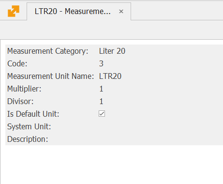

# Initial Setup

## 1. The measurement units codes should be defined acording the CL1 nomenclature

 

## 2. The Base measurement unit of products should be same as measurement unit used in article 28 and article 29 from law on excises and tax warehouses

## 3. It must be defined custom attributes with the following codes 

### 3.1. Products

\-     **Exc_BrandName** - Allowed values from CL175 nomencature. Limited to alowed values

\-     **Exc_Volume** – Volume  – decimal

\-     **Exc_LabelPrice** – Price on label – Only for specific products –Decimal

### 3.2. Documents

\-      **Exc_Purpose** –  Allowed values from CL200 nomenclature. Limited to alowed values

\-      **Exc_Driver** – In Property Value is filling National number of the vehicle and in Property Decription  – Driver name

\-      **Exc_InputDocumentType** - Value for tag DocumentType in section MeasureValues in the export file

\-      **Exc_InputDocumentNumber** - Value for tag DocumentNumber in section MeasureValues in the export file for eADD

### 3.3. ExciseAdministrativeDocumentLines

\-     **Exc_Payment** – Allowed values from CL163 nomenclature. Limited to alowed values

### 3.4. Parties

\-     **Exc_Country** – Allowed values from CL8 nomenclature

\-     **Exc_Region** – Allowed values from CL1101 nomenclature

\-     **Exc_Municipality** – Allowed values from CL1102 nomenclature

\-     **Exc_City** – Allowed values from CL1103 nomenclature

\-     **Exc_District** – Allowed values from CL1104 nomenclature

\-     **Exc_Street** – Street, Number – Text

### 3.5. DocumentTypes

\-     **Exc_DocumentType** – Allowed values from CL2305 nomenclature

\-     **Exc_OperationType** – Type of output from Tax Warehouse (For example 1021,1029)

 
