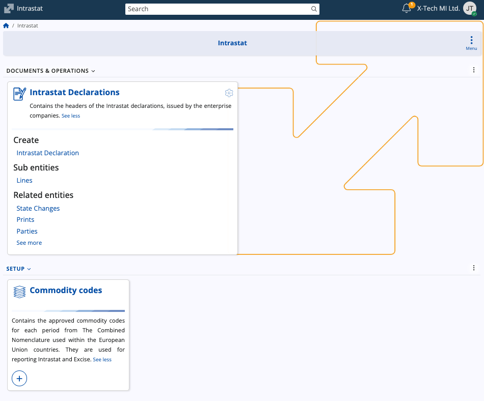
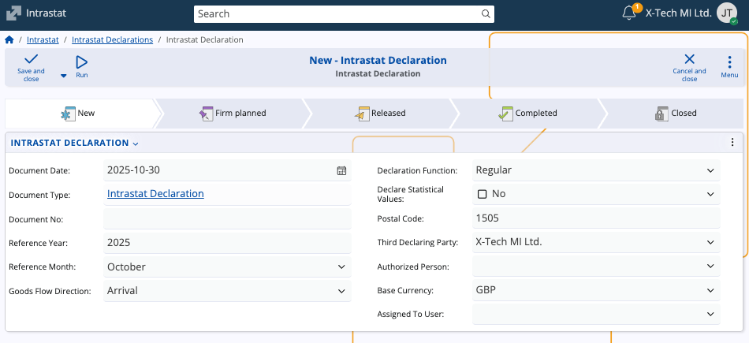

# Intrastat

**Intrastat** is the system used by the European Union to collect statistical data on trade in goods between member states. It serves to record the physical movement of goods across internal EU borders, replacing traditional customs declarations for intra-EU trade.

The **Intrastat submodule in @@name** allows enterprises to prepare, manage, and submit Intrastat declarations in compliance with EU statistical requirements. The system consolidates data on dispatches and arrivals of goods for accurate reporting to national authorities.

**Intrastat supports companies by:**

* Maintaining standardized records of goods traded within the EU.
* Facilitating the preparation of official Intrastat declarations.
* Storing and validating commodity codes used for classification of traded goods.
* Allowing submission through authorized representatives.

## Structure

The submodule contains two primary components:

1. **Intrastat Declarations** – Used to record and submit trade data for a given reporting period.
2. **Commodity Codes** – Contain the official Combined Nomenclature codes required for classifying goods in Intrastat reporting.

### Intrastat Declarations

The **Intrastat Declaration** entity holds the header information for each declaration prepared by an enterprise company. It represents a single submission to the national Intrastat authority for a specific reporting period, providing a consistent structure for:

* Statistical reporting of intra-EU goods movements.
* Verification of declared values and quantities.
* Preparation of electronic submissions to national Intrastat systems.

#### Fields

| Field                          | Description                                                                                                                                                                                                   |
| ------------------------------ | ------------------------------------------------------------------------------------------------------------------------------------------------------------------------------------------------------------- |
| **Document Date**              | The date the declaration document is created.                                                                                                                                                                 |
| **Document Type**              | Type of document, typically *Intrastat Declaration*.                                                                                                                                                          |
| **Document No**                | The internal document number assigned to the declaration.                                                                                                                                                     |
| **Reference Year**             | The calendar year for which the declaration is prepared. *This field is required*.                                                                                                                              |
| **Reference Month**            | The reporting month corresponding to the declared period.                                                                                                                                                     |
| **Goods Flow Direction**       | Indicates whether the declaration refers to **Arrivals** (imports from other EU member states) or **Dispatches** (exports to other EU member states). _This field is required_.                                 |
| **Declaration Function**       | Specifies whether the declaration is **Regular** or **Corrective**. Corrective declarations are used to amend previously submitted data.                                                                      |
| **Declare Statistical Values** | Determines whether statistical values are included in the report.                                                                                                                                             |
| **Postal Code**                | The postal code corresponding to the submitter’s address. _This field is required_.                                                                                                                             |
| **Third Declaring Party**      | The company or entity submitting the declaration. It is prefilled based on the currently logged-in enterprise company but can be changed. This party typically holds the electronic signature for submission. |
| **Authorized Person**          | The person authorized to submit the declaration.                                                                                                                                      |
| **Base Currency**              | The base currency used for monetary values in the declaration.                                                                                                                                                |
| **Assigned To User**           | The @@name user responsible for managing the declaration.                                                                                                                                                    |

### Commodity Codes

The **[Commodity Codes entity](https://docs.erp.net/model/entities/Finance.Excise.ExciseProductTypes.html#commoditycode)** contains the approved commodity classifications used in Intrastat reporting. These codes correspond to entries in the EU’s **Combined Nomenclature (CN)**, which standardizes the identification of goods traded within the European Union.

> [!NOTE]
>
> Commodity codes define the statistical category under which each product movement is reported and are also used in **[Excise reporting](https://docs.erp.net/tech/modules/financials/excise/definitions/other-excise-definitions.html)** within @@name.

### Fields

| Field                  | Description                                                                                                        |
| ---------------------- | ------------------------------------------------------------------------------------------------------------------ |
| **Commodity Code**     | The unique code identifying the goods category. It follows the Combined Nomenclature format (typically 8 digits). _Required._   |
| **Description**        | The textual description of the goods corresponding to the commodity code. _Required._                                          |
| **Supplementary Unit** | If not null, the related product should have an additional measurement unit with the same code as specified in this field. _Required._  |
| **Valid From**         | The start date from which the code is valid.                                                                       |
| **Valid To**           | The end date of validity. Blank if the code is currently active.                                                   |

> [!NOTE]
> 
> The screenshots for this article are from v.26 of the platform.
