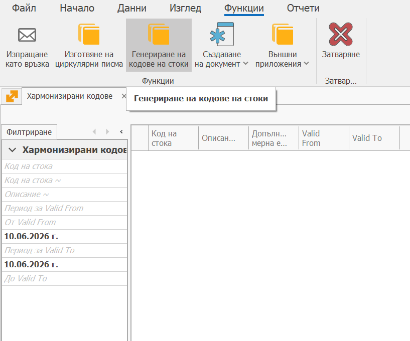

# SAF-T номенклатури на НАП

За да работят експортите на SAF-T e необходимо да се да се напави първоначално зареждане на предоставените номенклатури от НАП. 

1. Основната част от тях могат да се заредят с помощта на приложението:

https://operator.net/community/open-exchange-data-importer

Трябва да се влезе с оператора в текущата инстанция и да се стартира приложението.
На първа позиция има системен файл готов за импорт.

[Open Exchange Data Importer — Community](https://operator.net/community/open-exchange-data-importer)

2. Освен това трябва да се заредят Хармонизираните кодове на ЕС.

Това се прави от Регулаторни / Интрастат / Хармонизирани кодове / Функции / Генериране на кодове на стоки

Тези които ползват модул Интрастат или Акциз вече са ги заредили.

