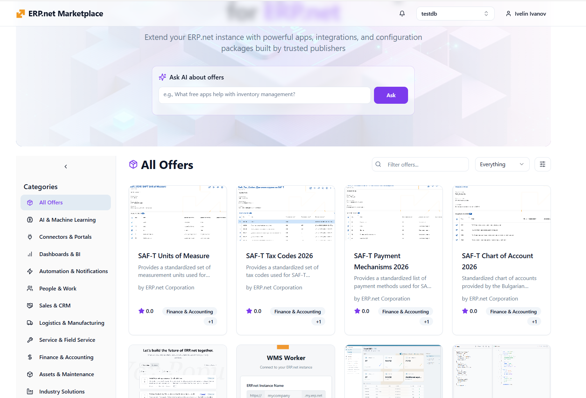

# SAF-T номенклатури на НАП

За да работят експортите на SAF-T e необходимо да се да се напави първоначално зареждане на предоставените номенклатури от НАП. Част от тях се намират в ERP.net Marketplace

[https://marketplace.erp.net/](https://marketplace.erp.net/)

Необходимо е да се инсталират следните:

1. SAF-T Chart of Account 
2. SAF-T Payment Mechanisms
3. SAF-T Tax Codes
4. SAF-T Units of Measure

**Трябва да се започне с SAF-T Chart of Account!**

Освен това трябва да се заредят Хармонизираните кодове на ЕС.

Това се прави от Регулаторни / Интрастат / Хармонизирани кодове / Функции / Генериране на кодове на стоки

Тези които ползват модул Интрастат или Акциз вече са ги заредили.

