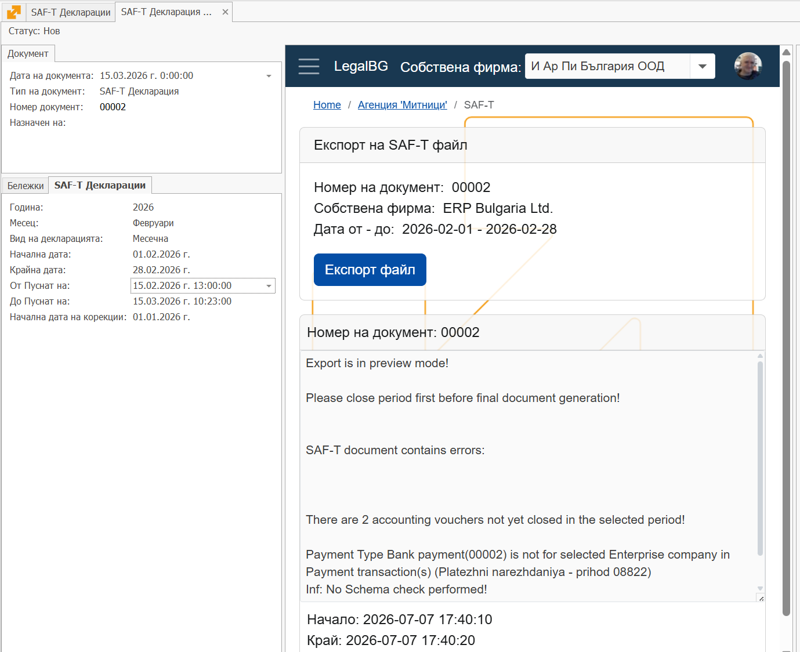
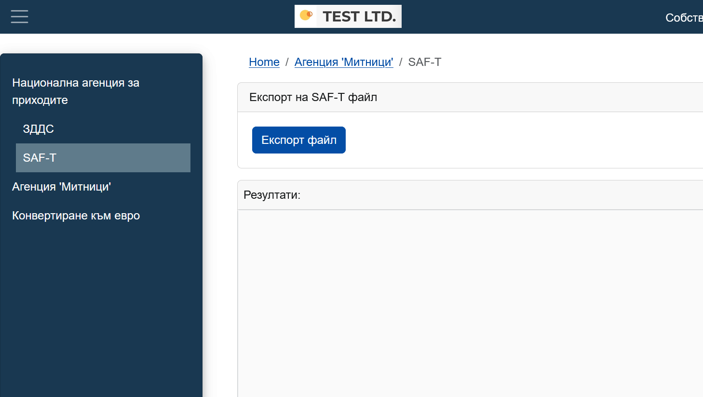
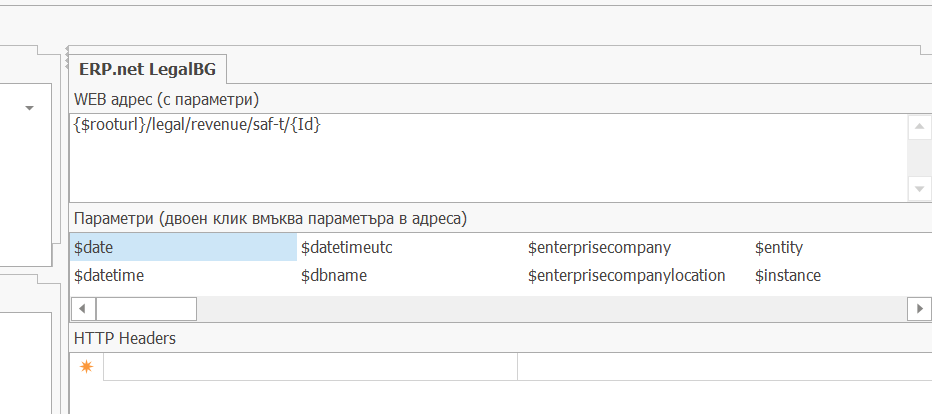

# Подготовка и експорт на SAF-T файлове

Изготвянето на SAF-T файлове се осъществява на следните стъпки:

1. Завършват се всички счетвоводни статии за периода на декларяцията. 
   Това се прави за да не се променят вече подадени данни. Преосчетоводяванията водат до червено сторно операции.

2. Създаване на документ SAF-T декларация

​	В Регулаторни / SAF-T има навигатор SAF-T декларации, където може да се съзаде нова декларация и да се видет вече 	създадените.

3. В декларацията се попълват следните данни:

   - Тип документ и Дата на документа. Обикновено в деня в който се създава декларацията. Датата няма отношение към периода, койнто декларираме.
   - Година и Месец, който декларираме. Това ще ни попълни авточатично "Начална дата" и "Крайна дата", коиото определят периода за който подаваме декланация.
   - Вид на декларацията: "Месечна", "Годишна" и "До поискване4. Това са трите вида декларации, изисквани от НАП. От този вид зависи структурата и вида данни, които подаваме.
   - Начална дата - начална дата на периода, който подаваме. 
     За месечна декларация това е първо число на месеца.
   - Крайна дата - крайна дата на периода. 
     За месечна декларация това е крайната дата в месеца.
   - От Пуснат на - датата и времето на експорт на предната месечна декларация.
   - До Пуснат на - текущото време на експорт на данните
   - Начална дата на корекции - първо число на годината в която започваме да подаваме SAF-T отчети. Преди тази дата не се теглят данни за отчетите.

   Как работи филтрирането? 

   - Включват се всички документи за периода между "Начална дата" и "Крайна дата", пуснати до текущия момент, респективно с време на пускане по малко от "До пуснат на".
   - Включват се всички документи за предни периоди (след "Начална дата на корекция"), които са пуснати след предишния експорт за предишния период. Респективно тези които имат времена на пускане по големи "От пуснат на" и "Дата на документа" по малки от "Начална дата".

​	Така например, ако на 15.02 в 13:00 часа направим експорт на документите за януари, то ще се включат всички документи пуснати до 13:00 часа на 15.02. Но след като подадем SAF-T отчета ние можем да продължим да въвеждаме документи за януари. Тези документи, въпреки, че за за януари ще ги подадем във февруарската декларация.
Когато подаваме декларацията за февруари ние ще укажем "От Пуснат на" =  15.02, 13:00 и така указваме във февруарската декларация да влязат всички документи за януари пуснати след 15.02, 13:00, тоест тези които са въведени след подаването на януарската дерларация, но се отнасят за януари.

4. Самият физически експорт се извършва от Legal_BG, секция НАП / SAF-T

   - От сайта Legal_BG  - след бутона "Експорт файл" се указва номера на декларацията и се експортира файла.

     

     

   - В SAF-T декрарацията, LEGAL_BG сайтът може да се покаже във WEB панел и директно от декларацията да се направи експорта. За целта се поставя следния линк в настройките на WEB панела:
     **{$rooturl}/legal/revenue/saf-t/{Id}**

     където legal e относителният URL адрес на LEGAL_BG сайта за тази инстанция.

     Във този WEB панел подаваме директно ID на тази декларация, така че Legal_BG се свързва с отворения документ и експортира неговите данни.

     

5. В панела за еспорт излизат намерени грешки при експорта. 

   Трябва да се уверерите че няма съществени грешки преди да преминете към подаване на файла към сайта на НАП.