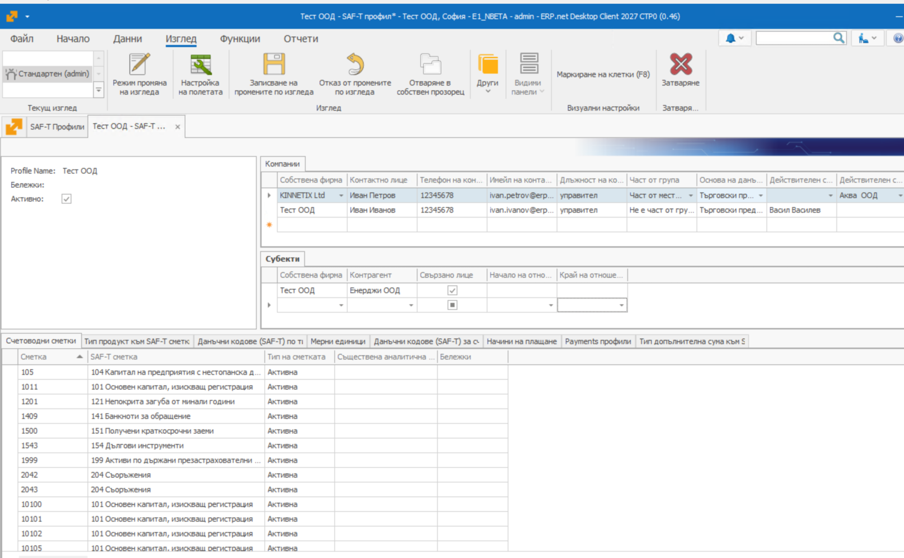

# SAF-T профили

SAF-T профилът е мястото където се прави връзката (мапинг) между вътрешните номенклатури в ERP.net и предоставените номенклатури на НАП.

Профилът може да се дефинира за една или повече собствени фирми, ако за тях дефинициите са еднакви.

В панел **Компании** се дефинират собствените фирми за които се прилага този профил.
За всяка собствена фирма се попълват полета, които се изискват в заглавната част на SAF-T файла:

- Контактно лице
- Телефон на контактно лице
- Имейл на контактно лице
- Длъжност
- Дали компанитята е част от група
- Основа на данъчното счетоводство - вида на дружеството
- Действителен собственик, ако е лице.
- Действителен собственик, ако е фирма.

В панел **Субекти** се изброяват свързаните лица и се слага отметка Свързано лице.
За тези контрагени ще се търси осчетоводяване по 405 и 415 сметки.

Останалите панели са за мапинги на номенклатури - сметки, данъци, осчетоводявания, начини на плащане и други.

## Настройки на SAF-T профила

- **[Съответствие на счетоводни сметки със SAF-T сметки](saft-accounts-maping.md)**
- **[Съответствие на типове продукти със SAF-T сметки](saft-product-type-mapping.md)**
- **[Съответствие на Допълнителни суми със SAF-T Счетоводни сметки](saft-additional-amount.md)**
- **[Съответствие на счетоводни операции със SAF-T данъчни кодове](saft-tax-codes-by-accounts-mapping.md)**
- **[Съответствие на типове сделки със SAF-T данъчни кодове](saft-tax-codes-by-deal-type-mapping.md)**
- **[Съответствие на платежни сметки със SAF-T счетоводни сметки](saft-payment-profile.md)**
- **[Съответствие на начините на плащане със SAF-T начини на плащане](saft-payment-type.md)**
- **[Съответствие на мерните единици със SAF-T мерни единици](saft-masurement-units.md)**
