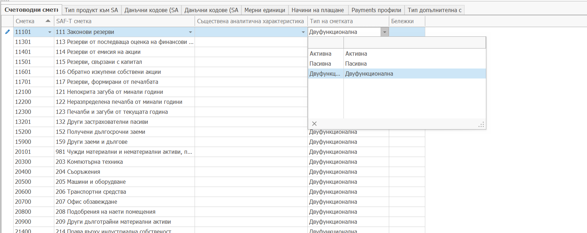
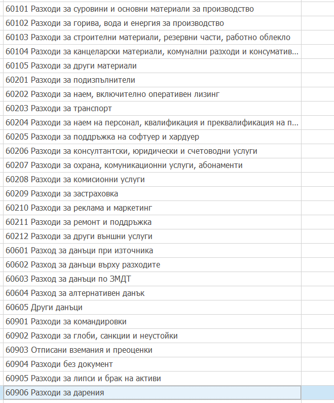

# Съответствие на счетоводни сметки със SAF-T сметки

В панел **Счетоводни сметки** на SAF-T профила се прави съответствието на счетоводните сметки с предоставените от НАП сметки. Мапингът е на ниво синтетични сметки.

- В поле **Сметка** се избира синтетичната сметка от ERP.net

- В поле **SAF-T сметка** се избира съответната SAF-T сметка. 

  Възможно е множество ERP.net сметки да сочат към една SAF-T сметка.
  Забранено е една ERP.net сметка да сочи към повече от една SAF-T сметка

- В поле **Съществена аналитична характеристика** се указва коя подред в дефиницията на сметката аналитичност се явява тази аналитичност, по която се търси съответствие със системна номенклатура.
  В случая това се използва да сметки 401, 405, 411 и 415, където се указва коя поред е анелитичност Контрагент. 
  По кода на контрагента в аналитичния ключ се издирва в последствие Клиент и Доставчик във фактури и плащания.
- В поле **Тип на сметката** се указва каква е сметката Активна, Пасивна или Двуфункционална. В ERP.net това не се дефинира, затова се указва в този мапинг.

Създаването на този мапинг изисква предварителна подготовка на счеткоплана. Синтетичната структура на сметкоплана трябва да се приведе според изискванията на НАП, тъй като не е возможно една синтетична сметка в ERP.net да се раздели на две и повече SAF-T сметки.
Това най вече е видимо във група 60, където НАП са дали разбивка, къв която трябва предварително да се преработи сметкоплана на синтетично ниво в ERP.net.

