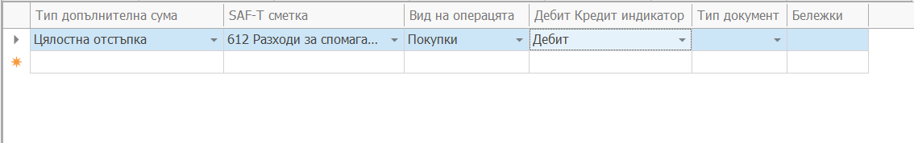

# Съответствие на Допълнителни суми  със SAF-T Счетоводни сметки

В панел **Тип допълнителна сума към SAF-T сметка**  се прави съответствието на допълнителни суми, които увеличават сумата на фактурата към SAF-T сметката по която се осчетоводяват.
В SAF-T фактурите сумата на фактурата се формира само от сумите на редовете и. Затова допълнителните суми в ERP.net, които увеличават сумата на фактурата се експортират като редове в SAF-T фактурата. Трябва да се укаже и сметка по която се осчетоводяват.
Условието е сумата да има отметки в дефиницията на допълнителната сучма "Добавяне към продуктите" и "Добавяне към клиентите" и това да не е ДДС сумата.

- В поле **Тип допълнителна сума** се избира типът продукт, участващ във фактура или покупна фактура.
- В поле **Вид на операцията** се указва дали осчетоводяването е за покупки или за продажби
- В поле **SAF-T сметка** се избира съответната SAF-T сметка по която се извършва осчетоводяването на тази сума.
- В поле **Дебит / Кредит индикатор** се избира вида на счетоводната операция - дебит или кредит.
- В поле **Тип документ** се избира типът документ да коойто се отнася това осчетоводяване. Може да се пропусне ако за всички типове документи този тип продукт се осчетоводява еднакво.

Необходимо е да се укаже ред за всяка допълнителна сума без ДДС, която увеличава сумата на фактурата. Тези суми трябва да имат отчетки "Добавяне към продуктите" и "Добавяне към клиентите".