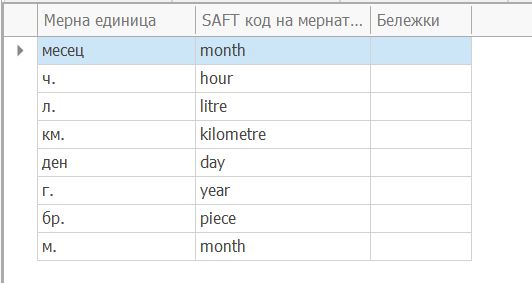

# Съответствие на мерните единици със SAF-T мерни единици

В панел **Мерни единици** на SAF-T профила се прави съответствието на мерните единици с предоставените от НАП мерни единици. 

- В поле **Мерна единица** се избира мерна единица от дефинираните в ERP.net

- В поле **SAF-T мерна единица** се избира съответната SAF-T мерна единица от предоставения списък на НАП. 

  

Мерните едници се декларират в редовете на фактури за покупки и продажби.
