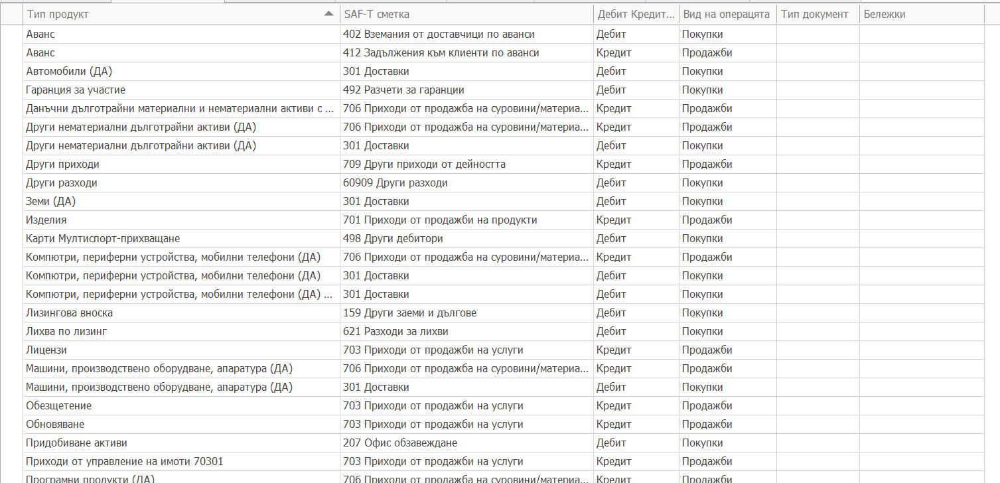

# Съответствие на типове продукти със SAF-T сметки

В панел **Тип продукт към SAF-T сметки** на SAF-T профила се прави съответствието на типовете продукти, които се използват в покупни и продажни фактури, към счетоводните сметки по които се осчетоводяват тези типове продукти.
Тази инфорамция се вади от счетоводните шаблони. Съответствието е един тип продукт за една сметка за един тип документ.
Когато един тип продукт се осчетоводява по различни сметки за един и същи тип документ, то се взима само първата сметка.

- В поле **Тип продукт** се избира типът продукт, участващ във фактура или покупна фактура.

- В поле **SAF-T сметка** се избира съответната SAF-T сметка. 

- В поле **Дебит / Кредит индикатор** се избира вида на счетоводната операция - дебит или кредит.

- В поле **Вид на операцията** се избира вида на фактурата - покупна или продажна.

- В поле **Тип документ** се избира типът документ да коойто се отнася това осчетоводяване. Може да се пропусне ако за всички типове документи този тип продукт се осчетоводява еднакво.

