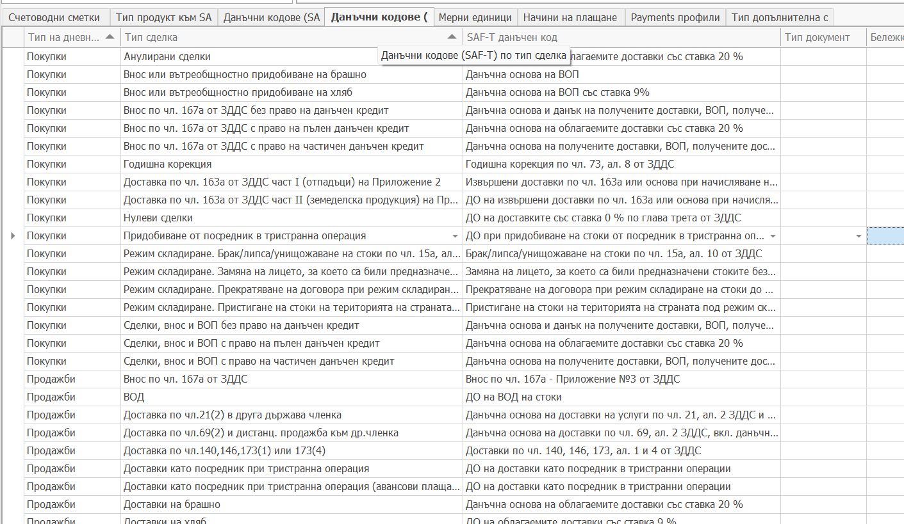

# Съответствие на типове сделки със SAF-T данъчни кодове

В панел **Данъчни кодове (SAF-T) по Тип сделка** на SAF-T профила се прави съответствието на тип сделка със съответен данъчен код.

Връзката е Тип сделка към SAF-T данъчен код от предаставения от НАП списък с данъчни кодове.

- В поле **Тип на дневника** се визуализира типът сделка за кой дневник е Покупки или Продажби.
- В поле **Тип сделка** се избира тази Тип сделка от списъка дефинирани типове сделки в  ERP.net.
- В поле **SAF-T данъчен код** се избира SAF-T данъчния код от номенкланурата на НАП.
- В поле **Тип документ** се избира типът документ да коойто се отнася този мапинг. Може да се пропусне ако за всички типове документи този тип мапингът е един и същ.

Настройката на това съответствие се отнася само да ДДС данъка. Типовете сделки по своята същност служат за определяне на ДДС данъка в документите за покупки и продажби. Това съответствие ги свъзрзва със предоставения списък с ДДС данъци за целите на SAF-T.

Ако за някоя фактура не се укаже такова съответствие се се логне грешка при експорта и ще се използва най честия ДДС данък 20%.
