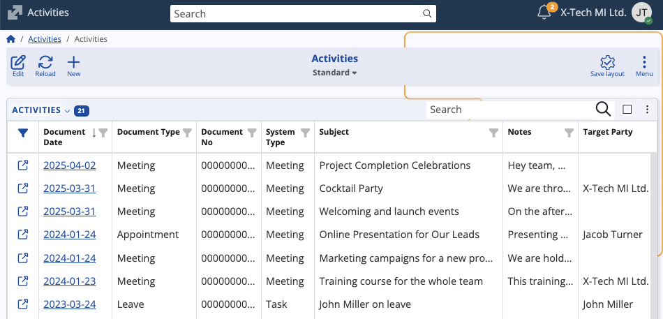
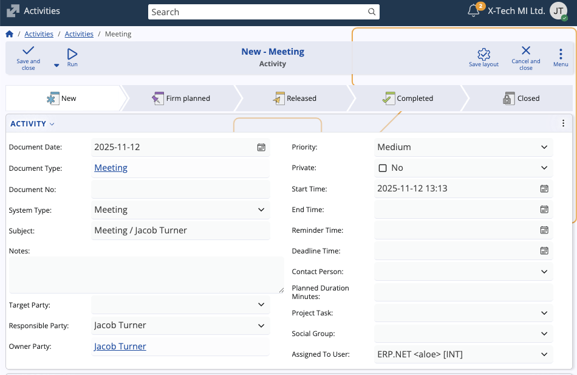
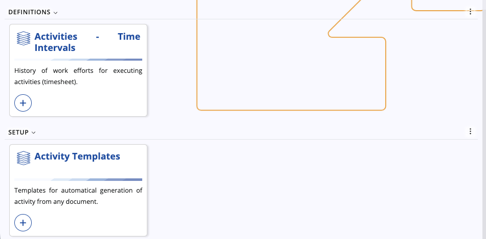

# Activities

Activities in @@name are documents providing flexible task and event tracking for people and teams. They can represent meetings, calls, appointments, leave, tasks, and any other user-defined document types. 

The **Activities** submodule centralizes planning and execution details: who is responsible, when it happens, what it is about, and who participates. Activities are integrated with other modules like **[Presales](https://docs.erp.net/tech/modules/crm/presales/index.html)** where they help manage communication and follow-ups with leads and opportunities.

> [!NOTE]
> Activities appear in the **@@name [Calendar](https://docs.erp.net/tech/modules/my/calendar/index.html#activities)** and can also be created from there. 

### Structure

The page consists of three panels:

- **Activities** – Main list and editor for all activity documents.  
- **Activities – Time Intervals** – History of work efforts for executing activities.
- **Activity Templates** – Templates for automatic generation of activities from other documents.

## Activity data

The **Activities** panel reveals the following information for each activity:

- **System Type** – Categorizes the activity at system level (e.g., *Meeting*, *Task*). If you start by choosing a *Document Type* that maps to a system type, this field is preselected.  
- **Subject**, **Notes** – Title and description of the activity.
- **Target Party** - External participant or target of the activity/task.
- **Responsible Party** - Party responsible for the execution of the activity/task. By default, this is the Owner, but it can be changed.
- **Owner Party** – The Party that created the activity document/task. 
- **Priority** - Importance level of the activity.
- **Private** – Decides whether the activity is public or visible only to its owner.
- **Start Time**, **End Time** – Date/time span of the activity.
- **Reminder Time**, **Deadline Time** – Optional scheduling helpers determining a reminder and a deadline for the activity/task.  
- **Contact Person** - The contact person who can be contacted from the side of the target party.
- **Planned Duration Minutes** - Total planned duration of the activity. Calculated automatically based on Start Time & End Time.
- **Project Task** - Optional link of the activity to a project task.
- **Social Group** - Optional link of the activity to a social group.
- **Assigned To User** – User to which the activity document is assigned. This is **required** for the activity to appear in their Calendar.

### Participants

Activities can optionally have specific participants, with each of them contributing a certain **Work Load Percent**. 

Marking someone as a participant automatically leads to the activity appearing in their personal calendars.

### Create an activity

You can create activities from the **Activities** panel:

1. Click **New** and choose a **Document Type**. This preselects the **System Type**.

   
   
2. Enter basic activity details such as **Subject** and **Notes** and any scheduling fields like **Start Time**, **End Time**, **Reminder/Deadline Time**.

   
   
3. Add **Participants** if applicable.

   
   
4. Click **Save and close** to save the new activity.

> [!TIP]
> You can also create activities directly from the Calendar. Read **[this short guide](https://docs.erp.net/tech/modules/my/calendar/index.html#create-an-activity)** to learn how.

## Other panels

The **Time Intervals** panel records time spent per activity, while the **Activity Templates** panel defines reusable defaults and automation for generating activities from documents elsewhere in @@name.

> [!NOTE]
> 
> The screenshots taken for this article are from v.26 of the platform.
