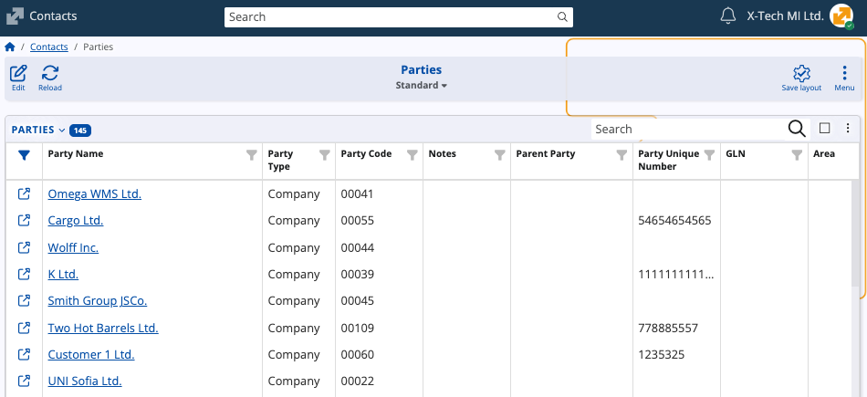
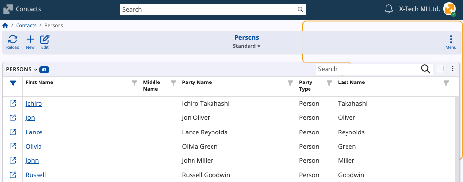

# Contacts

The **Contacts** submodule stores and maintains all contact-related information used across @@name. It provides a unified model for representing companies, persons, their internal structure, and the ways in which they relate to one another. 

These records serve as **foundational references in virtually every document** related to operational, financial, and CRM processes.

## Key terms

At its core, the module defines two system entities:

* **Party** – the universal base entity representing any organization or individual.
* **Person** – a specialized Party that stores personal attributes.

All companies, divisions, departments, locations, suppliers, customers, and natural persons are represented as **Parties**. 

### Party

A **Party** is the fundamental record identifying a company, business unit, or individual in @@name. 

Every company, division, location, department, supplier, customer, and employee can be represented as a Party.

### Person

A **Person** is a type of Party used to store personal details such as name, nationality, gender, and identification numbers.

Because a Person is a Party, it **must have** an associated Party record. 

## Structure

The Contacts submodule supports three parallel and independent structures for organizing companies:

| Structuring mechanism | Description                     |
| --------------------- | ------------------------------- |
| **Divisions**         | Organizational units within a company.    |
| **Locations**         | Physical locations such as branches or offices.     |
| **Departments**       | Departmental units attached to a company or person. |

These structures can coexist and do not override each other. A company may have multiple divisions, multiple locations, and multiple departments simultaneously. 

Divisions and locations are Parties and can therefore be organized hierarchically and related to other Parties.

### Companies

The **Companies** panel represents the company definitions used in all @@name modules. A Company is a Party with additional registration and tax-related fields. 

Companies typically contain **Contact Mechanisms**, filled with official addresses, emails, phone numbers, and websites.

> [!NOTE]
> You can link specific **customers** to a company. Customer records are maintained through a separate **[customer portal](https://docs.erp.net/tech/modules/crm/sales/customers/index.html?q=customers)**.

### Locations

The **Companies - Locations** panel contains physical company locations (e.g., headquarters, branches, warehouses). 

Each location is a Party and may have its own contact mechanisms, working time and location-specific identifiers.

### Divisions

The **Companies - Divisions** panel lists internal business divisions. A division is a Party and can be placed under a parent company or another division. 

### Parties

The **Parties** panel holds all Party records regardless of type. This includes companies, persons, customers, divisions, suppliers, and any other party types.

### Persons

The **Persons** panel stores all Person records used across the system. Each Person has a related Party and may be linked to a company, department, or another structure.

### Contact Mechanisms

The **Contact Mechanisms – Purposes** panel describes user-defined purposes for each contact mechanism type. 

Each purpose is linked to a **Contact Mechanism Type** (address, email, mobile phone, etc.) and appears as a selectable option when adding contact mechanisms to Parties or Persons.

This enables companies to classify contact details precisely, e.g.:

* Delivery Address
* Work Email Address
* Company Headquarters
* Official Correspondence by Phone

### Party Relationship Types

The **Party Relationship Types** panel defines allowed relationship classifications between Parties. 

Examples include:

* Founder of
* Co-Founder of
* Owner of

> [!NOTE]
> 
> The screenshots taken for this article are from v.26 of the platform.

