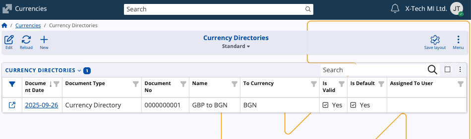
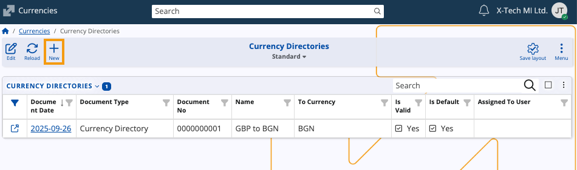
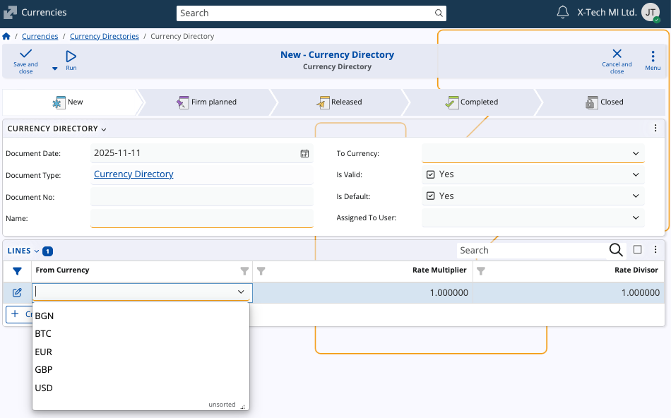

# Currencies

The **Currencies** submodule defines and manages the currencies used throughout the system. 

It ensures consistency when recording transactions, issuing documents, and maintaining exchange rates across **enterprise companies**. 

### Structure

The page is composed of two panaels: the user-defined **Currencies** and **Currency directories**.

## Currency directories

The **Currency Directories** panel contains named sets of currency exchange rates against a single base currency for a given date. 

Multiple directories with different names can exist for the same date, allowing separate rate sets.

Each directory carries the following basic information:

- **Name** – A descriptive unique label for the directory (for example, *GBP to BGN*).  
- **To Currency** – The target currency for the conversions of the directory.  
- **Is Valid** – Indicates whether the directory is active for use.  
- **Is Default** – Marks the directory as the default one for conversions. When there are more than one default directory, the last default directory is used. 

The **Lines** panel is used to define the actual exchange rates used in the directory:

- **From Currency** – The currency being converted from.  
- **Rate Multiplier** – The multiplier applied when converting from the source currency.  
- **Rate Divisor** – The divisor applied during conversion.

 

### Create a currency directory

To create a new currency directory:

1. In Currency Directories, click on **New** from the toolbar.

   
   
2. A creation form will open where two fields are required:
   
   - **Name** – Provide a descriptive name (for example, *USD to EUR*).
   - **To Currency** – Select the target currency.
     
     You can optionally mark **Is Valid** and **Is Default**.
     
3. In the **Lines** section, you can choose to add one or more currency pairs now or later:

   
   
   - Choose a suitable **From Currency** from the dropdown list.
   - Enter preferred **Rate Multiplier** and **Rate Divisor** values.
     
4. When ready, select **Save and close** to create the directory

   Once saved, the directory can be edited or updated as needed.

## Currencies

The **Currencies** panel lists all user-defined currencies available in @@name. Each record shows the currency **sign**, **name**, and **show order**.

From this panel, you can add new currencies or edit existing ones to align with your organization's requirements.

> [!NOTE]
> The screenshots taken for this article are from v.26 of the platform.
