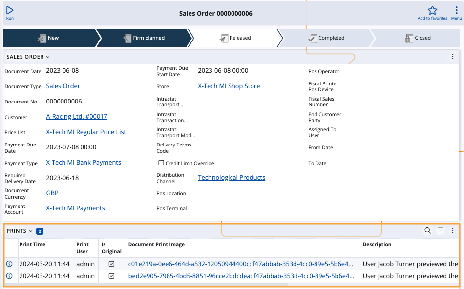

# Document print images 

Document print images contain the data of a **printout** of a document as it was obtained at the moment of printing. 

This data is used as a history in order to review the visual representation of the printed document.

### Delete old images

Document print images often take the most space in customer databases. 

One means of managing them is to **delete** the more obsolete records periodically. This can be done with the **[Deletе old document print images](https://docs.erp.net/tech/advanced/jobs/J30903.html?q=J30903%20Delet%D0%B5%20old%20document%20print%20images)** system job. 

However, there is a way to not even track print records in the first place.

## Print images tracking

For every **document type**, you can configure a **setting** that allows you to decide if printouts will be tracked for all documents of this type.

This is done to ensure that no unnecessary amount of space is accummulated as a result of constant print image tracking.

### Step-by-step process

1. Go to a document type definition (e.g. Sales Order) and navigate to the **Track Print Images** field.

   If this field is not visible, enable it using the **Customize panel** option.

2. Select one of the available settings:

   * **Do not track** - prevents printouts of all documents of the respective type to be automatically created.
     
   * **Save source data (compressed)** - allows visual representations of printed documents of the respective type to be saved and available for preview.
  
     

     If this setting is active, the **Prints** panel of every document of the respective type will begin to create records for print images every time that document is printed.

     
   
