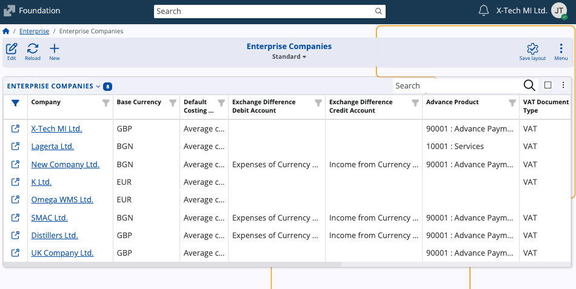
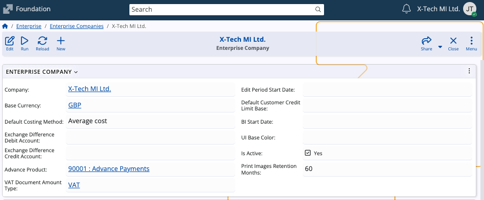
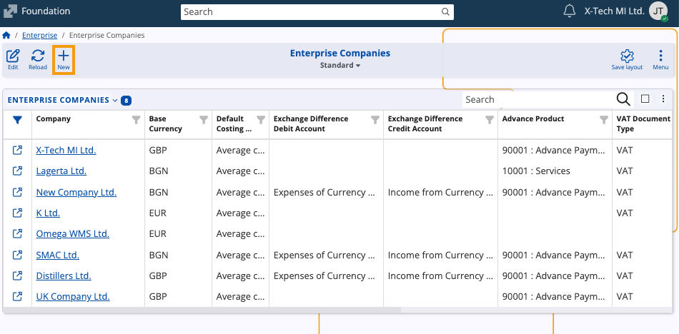

# Enterprise

The **Enterprise** submodule defines and manages the companies that operate within an enterprise. 

In @@name, eterprise companies represent the organizational entities that issue documents, maintain accounts, and serve as the base units for business operations.

## Interface

The page consists of a single **Enterprise Companies** panel which lists all companies defined in the system. 

Each record includes the enterprise company name, base currency, costing method, and other key configuration details such as debit and credit accounts for exchange differences, advance product, and VAT document amount type.

## Enterprise company details

Selecting an enterprise company opens its detail form. 

It contains both general configuration fields as well as related data tables that define how the company operates within the enterprise.

- **Company** – Links the enterprise company to an existing base company record in the system. 
- **Base Currency** – Defines the main operational currency of the enterprise company. 
- **Default Costing Method** – Determines how costs are evaluated. Currently supported methods are EXP - Explicit lot specifying, and AVG - Average cost.
- **Exchange Difference Debit Account / Credit Account** – Define the accounts for balancing accounting vouchers with debit/credit difference due to currency exchanges.
- **Advance Product** – Specifies the product used for handling advances in trade documents. 
- **VAT Document Amount Type** – Determines the VAT type applied to issued documents.   
- **Default Customer Credit Limit Base** – Sets the base for calculating customer credit limits.
- **Edit Period Start Date** - Sets the start date of the period when the documents can be edited.
- **Default Customer Credit Limit Base** - Determines the customer credit limit used by default when creating new customers. It is specified in the base currency of the enterprise company.
- **BI Start Date** - Defines the period for which BI extracts data (BI includes documents with **Document Date** greater than or equal to **BI Start Date**).
- **UI Base Color** – Allows assigning a visual color for distinguishing this enterprise company.  
- **Is Active** – Indicates whether the enterprise company is active in the system.  
- **Print Images Retention Months** – Defines the period (in months) for retaining printed document images.  

### Related data

Each enterprise company can include several related panels that can add to its operational setup.

- **Accounts** – Lists accounting records linked to the enterprise company.  
- **Payment Accounts** – Defines available bank or cash payment accounts.  
- **Transfers** – Stores any transfer movements between payment accounts (if applicable).  
- **Payment Types** – Specifies the payment methods for the company and associates them with payment accounts.  
- **Products** – Displays a list of products connected to the enterprise company, including their part numbers, product groups, and measurement units.  

## Create an enterprise company

To add a new enterprise company:

1. In the Enterprise Companies page, click on **New** from the toolbar.

   

2. The creation form will open where two fields are required.

   
   
   - **Company** – Choose an existing company from the list.
   - **Base Currency** – Select the base operational currency.

     Fill in any of the other configuration fields as needed.
     
3. When finished, select **Save and close** to create the new company.

   It will become available in the list and can be further configured with accounts, payment types, and other related data.

> [!NOTE]
> 
> The screenshots taken for this article are from v.26 of the platform.
