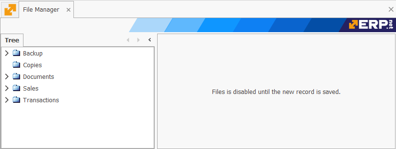

# File manager

The **File manager** is where you can create and store folders with different files inside. It follows a hierarchical tree order, similar to the one found in [Product groups](https://docs.erp.net/tech/modules/general/products/product-groups/index.html). With the help of the ribbons, you are able to peek inside a complex structure without getting lost.

Each folder can have an unlimited number of **subfolders**, the order of which is decided by pre-defined filters. You can view the contents of a folder if you right-click it and select the **Definition** command. The contents of the folder can be seen in the window that opens. There are also options to **rename**, **remove**, or create a **new** subfolder within the selected folder.

Moreover, @@name allows important **documents** (such as contracts and statistics) to be embedded, from one to dozens at a time. Currently, it is possible to embed a file only in the **[New]** window, where "[New]" is the folder's name. To do so, right-click inside the panel and select **Insert new file -> Embedded File**.

You can create individual folders folders by right-clicking anywhere inside the **Tree** panel and selecting the **New** command. 

This triggers **Edit Mode**, where a window outside of the **File Manager** pops up and allows for the creation of the new forder. 

- **Parent Folder** - whatever you select from the dropdown will make the new folder its subfolder.
- **Folder Name** - this is the name of the folder or subfolder.
- **Notes** - these are optional details characterising the new folder or subfolder.

Storing files into folders allows for flexibility and security when working with sensitive documents. You will need to select the documents from the location that you store them. Once uploaded, they become part of the folder and are subject to the management capabilities of the **File Manager**.

The quickest way to open a file is by **double-clicking** it. Its contents will be revealed straight away. You can also see files in different viewing modes, ranging from extra large icons to tables with detailed rows.

