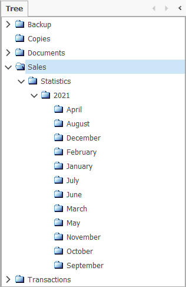
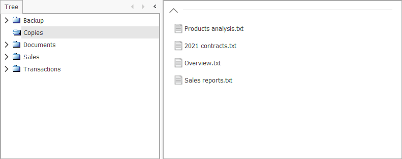
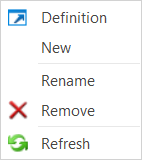
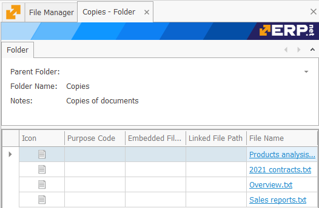
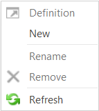
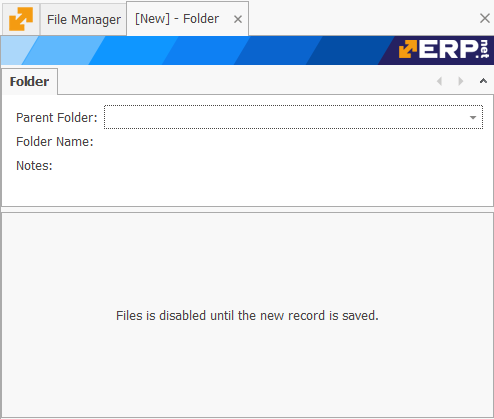
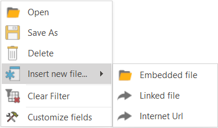
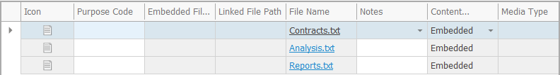
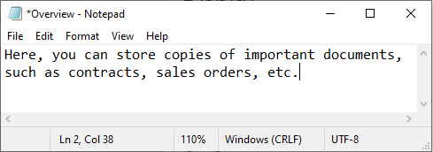
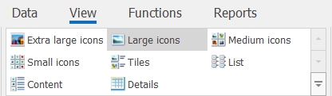

# File manager

The **File Manager** is responsible for creating and storing folders with different files inside. It follows a hierarchical tree structure similar to the one found in [Product Groups](https://docs.erp.net/tech/modules/general/products/product-groups/index.html). 

Each folder can contain an unlimited number of **subfolders**, the order of which is decided by pre-defined filters. 

Moreover, @@name allows important **documents** (such as contracts and statistics) to be embedded, from one to dozens at a time.

The contents of a folder can be viewed once it is selected, right-clicked, and the **Definition** command is executed.

You can also **rename**, **remove**, or create a **new** subfolder within the folder.

Individual folders can be created via the **New** command following a single right-mouse click on anywhere inside the **Tree** panel.

**Edit Mode** is triggered, and a window separate from the File Manager allows for the naming and grouping of the new forder. 

- **Parent Folder** - from the dropdown, a main entry is selected, thus making the new folder its subfolder.
- **Folder Name** - this is the name of the folder or subfolder.
- **Notes** - these are optional details characterising the new folder or subfolder.

Before proceeding further, the File Manager needs to **save** the current progress to complete the folder creation process.

**Inserting** files into a new folder can happen once it has been saved and following a single right-mouse click.

Once embedded, they become part of the folder and are subject to the management capabilities of the **File Manager**.

The quickest way to open a file is by **double-clicking** it. Its contents will be revealed immediately. 

File can also be organized into different viewing modes, each suited to a potential user's needs. 

