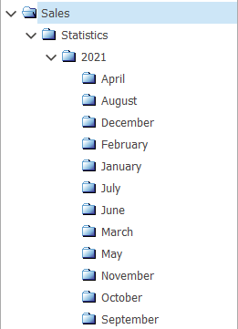

# File manager

The **File Manager** is responsible for creating and storing folders with different files inside. It follows a hierarchical tree structure similar to the one found in [Product Groups](https://docs.erp.net/tech/modules/general/products/product-groups/index.html). 

Each folder can contain an unlimited number of **subfolders**, the order of which is decided by pre-defined filters. 

Moreover, @@name allows important documents (such as contracts and statistics) to be embedded, from one to dozens at a time.

