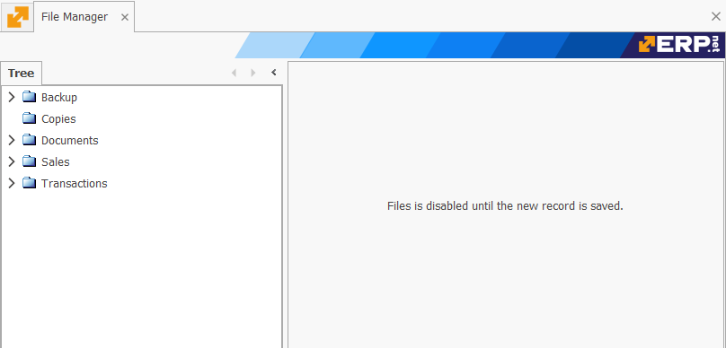

# File manager

The **File Manager** is responsible for creating and storing folders with different files inside. It follows a hierarchical structure similar to the one found in [Product Groups](https://docs.erp.net/tech/modules/general/products/product-groups/index.html). Any folder can have as many subfolders as needed. Moreover, @@name allows documents such as contracts and sales orders to be embedded, from one to several at a time.

