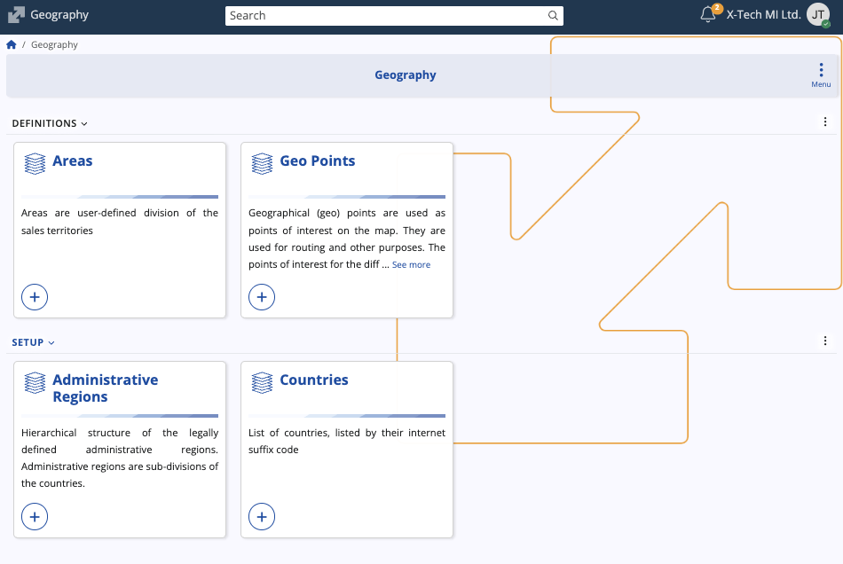
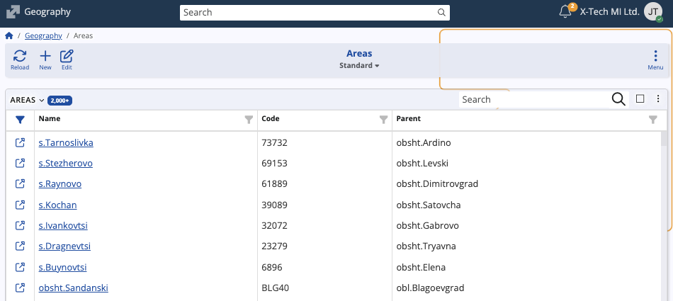
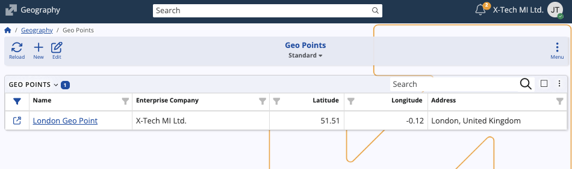

# Geography

The **Geography** submodule in @@name defines and maintains geographical data used across the system. 

It provides a structured way to organize locations, territories, and administrative regions, enabling consistent geographic references in documents, addresses, routes, and enterprise operations. 

## Structure

The submodule contains four panels:

- **Areas** – User-defined divisions of sales or operational territories. Areas can be hierarchical, with parent–child relationships, and are used to segment markets, assign representatives, or manage regional reporting.  
- **Geo Points** – Geographic points (latitude and longitude) that serve as locations or points of interest on the map. Each point can be linked to an enterprise company and include address information.  
- **Administrative Regions** – Hierarchical representation of legally defined regions within countries (such as states, provinces, or municipalities). These records support structured address data and country subdivisions.  
- **Countries** – A list of countries identified by their international suffix codes.

## Data contents

Each panel maintains specific datasets that contribute to @@name’s overall geographic framework:

- The **Areas** panel lists all defined sales or operational areas, including their **Name**, **Code**, and **Parent** area (if applicable).

  

- The **Geo Points** panel displays **Name**, **Enterprise Company**, **Latitude**, **Longitude**, and **Address**, enabling mapping or navigation functionalities.

  

- The **Administrative Regions** panel includes **Code**, **Name**, **Country**, **Parent Full Path**, and **Validity Dates**, which define the active period of each region.

  

- The **Countries** panel shows all supported countries with their respective **Code**, **Name**, and **Intrastat Code**, ensuring consistent country information across the system.

  

From each panel, you can **view** existing records, **edit** entries, or **create** new ones. 

> [!NOTE]
> 
> The screenshots taken for this article are from v.26 of the platform.
