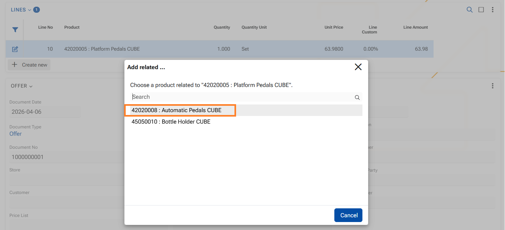
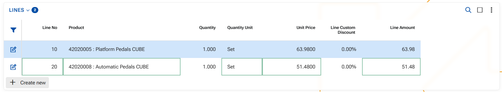
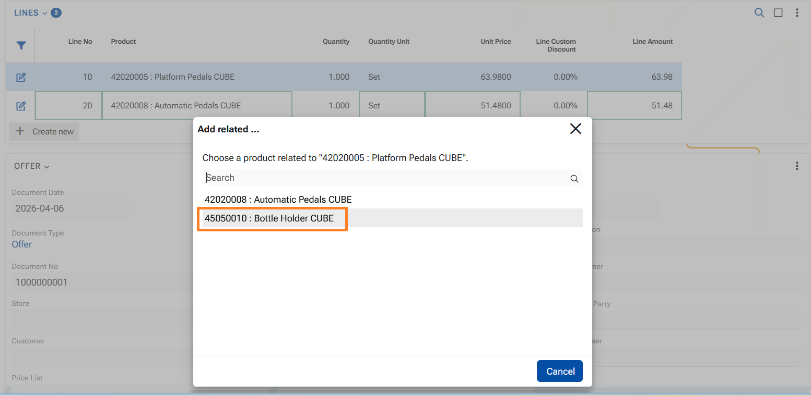
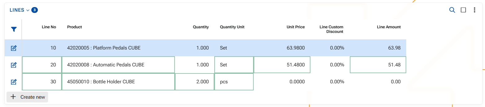
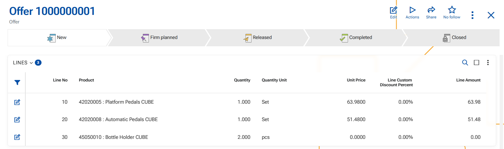

# How to use function "Add related"

The function allows you to add a related product in a document line based on predefined product relations of type **Merchandising** between the base product and the added product.

This enables quick addition of complementary or promotional products (e.g., accessories, gifts, add-ons) without manually searching for them. Generally this feature aims at increasing the total amount of the sale or offer.

Unlike product Replacement, this function does not modify the original product. Instead, it adds a new document line with the selected related product.

A related product is available only if there is an active product relation, where:

- **From Product** is the product in the current document line
- **To Product** is the related product
- **Product Relation Type** engaging the products is of System Type = **Merchandising**

A product can be referred to as a Merchandise (related) if there is a valid relation in terms of the dates of the relation itself:
- **From Date** is empty or earlier than or equal to today
- **To Date** is empty or later than or equal to today

If the relation has a defined **QtyFactor**, it is used to calculate the quantity of the added product, like this: New quantity (ToProduct) = Current quantity (FromProduct) × QtyFactor

As a **result** of the addition:

- A new document line is added below the current line;
- The selected related product is inserted in the new line, its quantity calculated by the Qty factor;
- The original product and line details remain unchanged

Generally speaking, the system treats the addition as another document line, but the core is that there is close relation between the products and one leads to the another.

Function "Add related" is available for use in the WEB client only.

**1.** In the document, click into the Product field in the document line.

Ensure that the Product field in the current document line contains a product. The option is available only when a product is present in the field.

**2.** Right-click to open the context menu.

**3.** Select "Add related" option - a pop-up window will open.

The list contains all products, that are linked to the current product and in an active Merchandising relation.

**4.** In the pop-up window click on a desired related product.
   
As a result a new ine will be added in the lines panel, containing the related product and respective attributes.

**5.** If you need to add another related product, repeat steps 1 - 4.

The next related product is added into another line, and the Qty factor is observed (2pcs of product 45050010 are added for 1 set of product 42020005)

**6.** Save the document.

