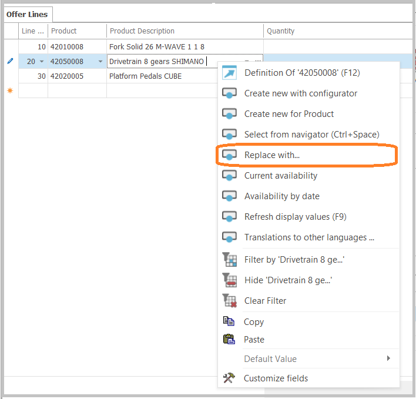
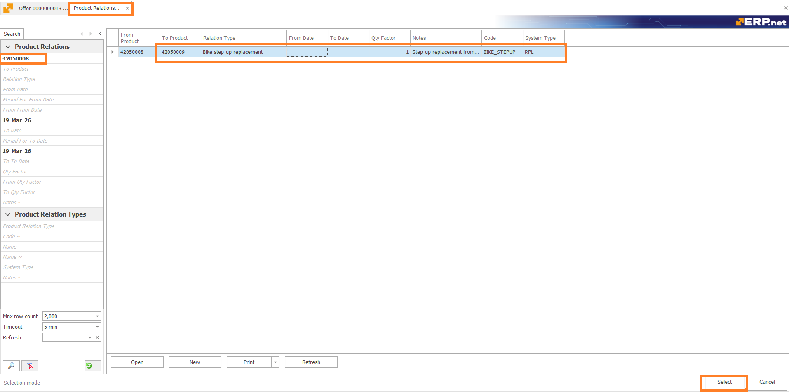
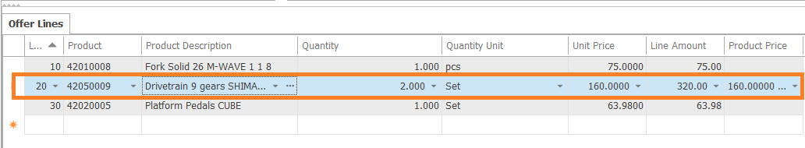
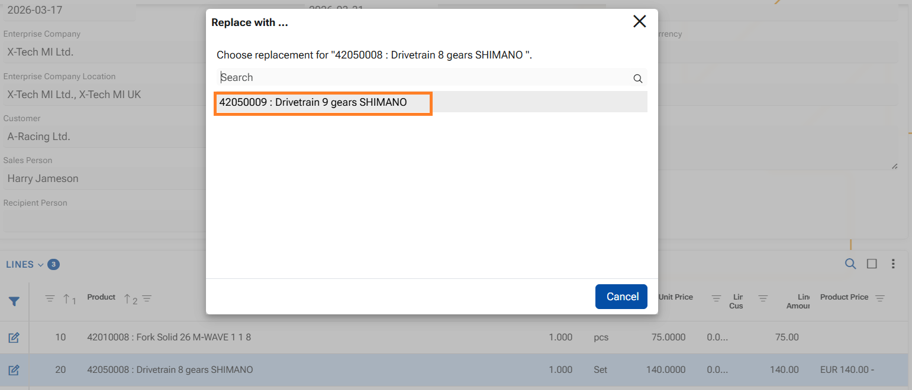
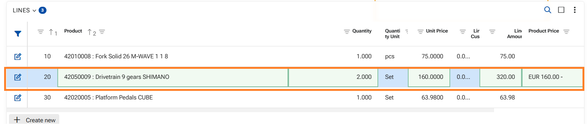

# How to use function "Replace with..."

ERP.net allows you to replace _one_ product in a document line with _another_ product that has been defined as a valid **Replacement**.  
The feature is available in both the **Web Client** and the **Desktop Client**. It helps users select approved substitute products without searching manually and ensures that only currently valid replacements are offered. 

The product replacement function is executed within a document (an Offer, an Order...) and involves three main elements:

- **From Product**  
  The original product in the document line that will be replaced.

- **To Product**  
  The substitute product that replaces the original product.

- **Product Relation Type** with **System Type = Replacement**  
  The relation type that marks the link between the two products as a valid replacement relation.

A product can be replaced only when there is an active **Product Relation**  - relation validity period:

- **From Date** must be empty or earlier than or equal to the current date.
- **To Date** must be empty or later than or equal to the current date.

If the selected replacement relation includes a **QtyFactor**, the quantity in the document line is recalculated automatically when the replacement is performed.

**As a result:**
- The selected replacement product is entered in the **same document line**, replacing the original product. The replacement does not create a new line;
- The quantity is recalculated in the same line - eg. if QtyFactor = 2, the original quantity is multiplied by 2;
- The price is updated for the new product.
- The measurement unit is updated for the new product.

Generally speaking - the system treats the replacement product as if it were originally in the line, but respects the details from the Relation.

In the next sections, you will see how to use this function in each client.

## In Desktop client 

   **1.** Ensure that a product is already entered in the **Product** field of the document line. The function is available only when the field contains a product.

   **2.** Right-click in the field and reveal the context menu;  

  
  **3.** Click **"Replace with..."** in it - the system opens a filtered navigator with the available replacements for the current product;

  **4.** In the navigator, select the desired product relation;
  
  **5.** Confirm with button **Select** in the lower-right corner.

Finally the product is replaced in the same line, quantity, measurement unit and price respected.

## In WEB Client

**1.** Ensure that a product is already entered in the **Product** field of the document line.  The function is available only when the field contains a product;

**2.** Right-click the **Product** field to open the context menu;

**3.** In the context menu, click **Replace with...**.

**4.** A modal window appears. It contains the valid replacement products

**5.** Click the desired replacement product in the modal window.

After selection, the replacement product is immediately substituted in the same line, quantity, measurement unit and price respected.

