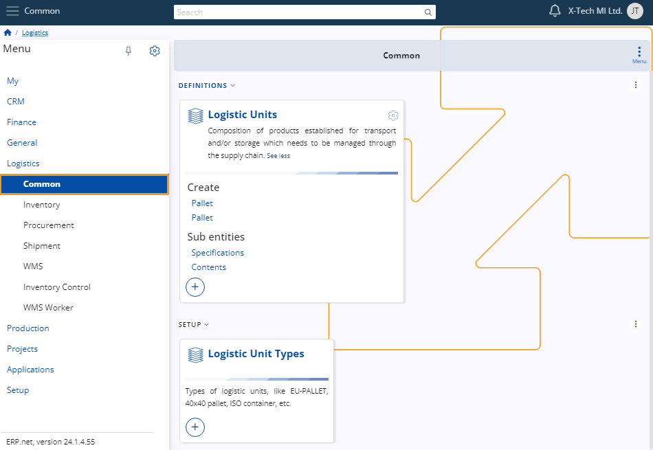
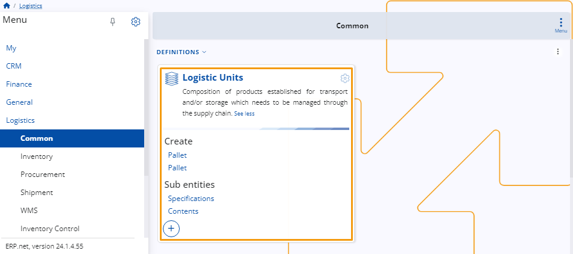
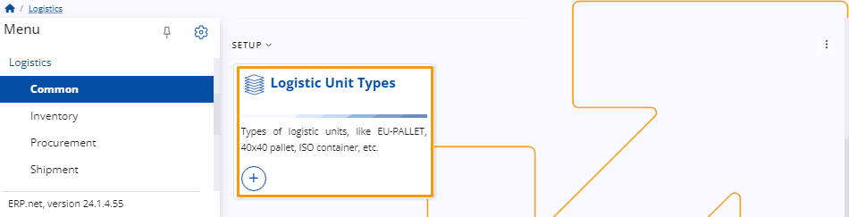

# Common 

This submodule allows you to define **logistics units** and their **types**.

These units are subsequently employed across other submodules, ensuring consistency and efficiency in all logistics-related processes.

### Logistics unit types

Before you can set up a logistics unit, you need to define its **type**. 

This is a predefined category that specifies the characteristics of the units used in the handling and transporting of goods, such as pallets, containers, or crates. 

They ensure standardized handling and compatibility across logistics operations.

### Logistics Units

Once you have at least one type set, you can proceed with defining a logistic unit. 

One unit represents a combination of products designated for transportation and/or storage within the supply chain. 

Efficient management is essential to ensure seamless integration and efficiency throughout their logistical lifecycle.

Learn more about **Common** in the following articles:

*	**[Logistic Unit Types](https://docs.erp.net/tech/modules/logistics/common/logistic-unit-types.html)**
*	**[Logistic Units](https://docs.erp.net/tech/modules/logistics/common/logistic-units.html)**

> [!NOTE]
> 
> The screenshots taken for this article are from v24 of the platform.
