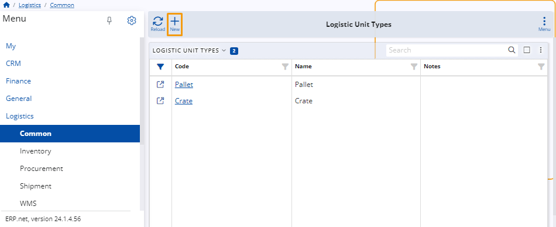

# Logistic unit types

A unit type is a custom category that specifies the characteristics of logistics units used in the handling and transportation of products.

Examples of logistic unit types include pallets, containers, and crates.

They ensure standardized handling and compatibility across all logistics-related operations.

## New logistic unit type 

To create a new logistic unit type, click on the circular **"+"** button on the **Logistic Unit Types** panel.

Alternatively, click the title of the panel and then the **New** button at the top-left corner of the unit types table.

You'll be taken to a separate page where you need to fill out several fields:

* **Code** - Input a unique code for the logistic unit type (required).
  
* **Name** - Provide a descriptive name for the logistic unit type (required).
  
* **Notes** - Any additional notes or details can be added here.

When you are ready, click on the **Save and reload** button to finish the creation process.

> [!NOTE]
> 
> The screenshots taken for this article are from v24 of the platform.
