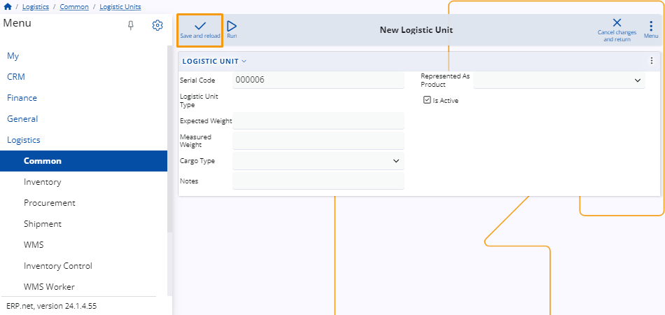

# Logistic unit types

Logistics Unit Types are predefined categories that specify the characteristics of units used in handling and transporting goods, such as pallets, containers, or crates.

They ensure standardized handling and compatibility across logistics operations.

## New logistic unit type 

To create a new logistic unit type, go to the **Logistics** module in the **Common** section. Then, click on the circular "+" button on the **Logistic Unit Types** panel.

Alternatively, choose "Logistic Unit Types" and then click on the "New" button at the top of the table showing all existing logistic unit types on the platform.

> [!NOTE]
> 
> Regardless of the method chosen, the creation process for a logistic unit type remains the same.

After completing the previous steps, you'll be directed to a new page where you'll need to fill in several fields:

- Code: Input a unique code for the logistic unit type.
- Name: Provide a descriptive name for the logistic unit type.
- Notes: Any additional notes or details can be added here.

When you are ready, click on the **Save and reload** button to finalize the creation. 

To quit the process, you can click on **Cancel changes and return**.

> [!NOTE]
> 
> The screenshots taken for this article are from v24 of the platform.
