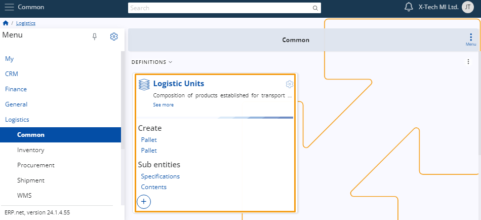
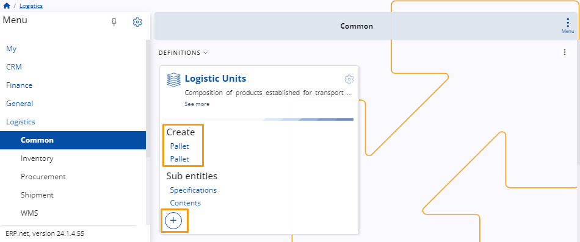
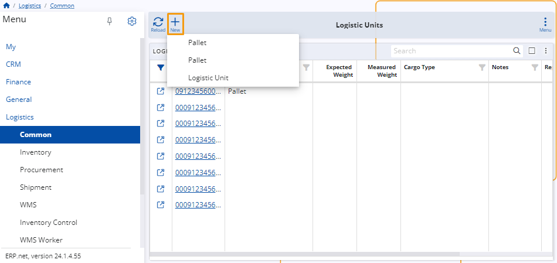

# Logistic Units 

Logistic units represent the combination of products designated for transportation and/or storage within the supply chain. 

Efficient management is essential to ensure seamless integration and efficiency throughout their logistical lifecycle.

## New logistic unit 

To add a new logistic unit, navigate to the **Logistics** module within the **Common** section. 

You can click on the circular **"+"** button located on the **Logistic Units** panel or select one of the **logistic unit types** under **Create**.

Alternatively, you can select **Logistic Units** and then click on the **New** button located at the top of the table displaying all existing logistic units on the platform.

> [!NOTE]
> 
> You can either choose a logistic unit type or create a logistic unit without one. 

Once you've completed the previous steps, a new page will open, prompting you to fill in several fields:

* **Serial Code** - This is the only mandatory field.
  
* **Logistic Unit Type** - If you've selected a unit type, it will be automatically added here.
  
* **Expected Weight** - This is the calculated weight.
  
* **Measured Weight** - The weight measured in the warehouse.
  
* **Cargo Type** - Select from the drop-down menu.
  
* **Notes** - Additional notes can be added here.
  
* **Represented As Product**
  
* **Active Status** - Check the box if the logistic unit is active.

When you are ready, click on the **Save and reload** button to finish the creation process

> [!NOTE]
> 
> The screenshots taken for this article are from v24 of the platform.
