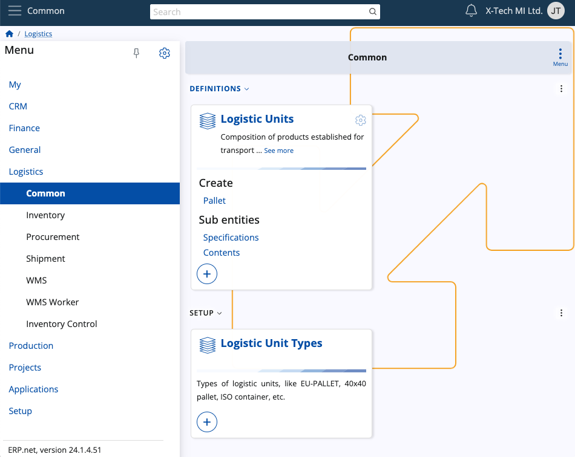
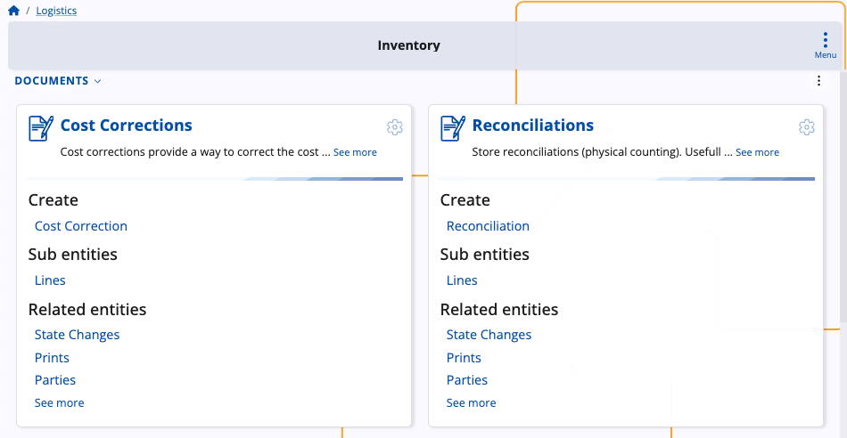
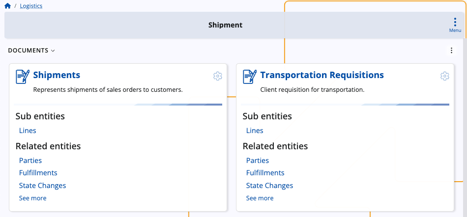
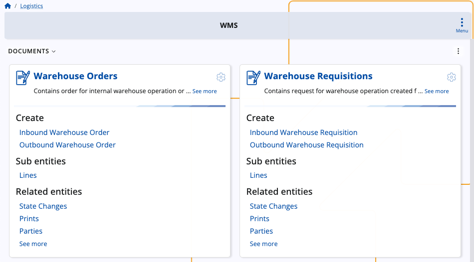

# Logistics

The **Logistics Module** serves as the cornerstone of efficient warehouse management and product availability control within your business infrastructure. 

It is designed to streamline operations and optimize processes across all aspects of your logistics operations.

It also provides a comprehensive suite of functionalities that empower you to effectively manage every aspect of your warehouse operations. 

From procurement to shipment, and inventory control to warehouse management, this module offers a robust set of tools and features to meet the diverse needs of your business.

**Procurement**, one of the key components of the **Logistics Module**, empowers you to monitor material sourcing within your warehouse environment.

With the ability to establish suppliers, initiate purchase requests, and manage internal requisitions, you gain full visibility and control over your procurement processes.

In conjunction with procurement, the **Inventory** module offers advanced capabilities for managing inventory across interconnected warehouses.

From defining store locations to tracking warehouse lots and serial numbers, this module provides the tools you need to maintain accurate inventory records and ensure product traceability.

The **Shipment** module plays a vital role in streamlining the shipping process for purchased stock. 

With features such as generating store orders and transactions, as well as managing shipment orders, you can effectively coordinate and track the movement of goods from your warehouse to your customers.

The **Warehouse Management System (WMS)** component of the **Logistics Module** elevates your warehouse operations to new heights. 

With features for generating warehouse documents, managing warehouse requisitions and orders, and fulfilling orders efficiently within the **WMS Worker**, you can optimize warehouse workflows and improve operational efficiency.

**Learn more:**

- **[Inventory](https://docs.erp.net/tech/modules/logistics/inventory/index.html?q=Inventory)**
- **[Procurement](https://docs.erp.net/tech/modules/logistics/procurement/index.html?q=Procurement)**
- **[Shipment]()**
- **[Warehouse management (WMS)](https://docs.erp.net/tech/modules/logistics/wms/index.html?q=Warehouse%20management%20(WMS))**
- **[Concepts](https://docs.erp.net/tech/modules/logistics/concepts/index.html?q=Common%20concepts)**
- **[Planning concepts and operations](https://docs.erp.net/tech/modules/logistics/planning/index.html?q=Planning)**

