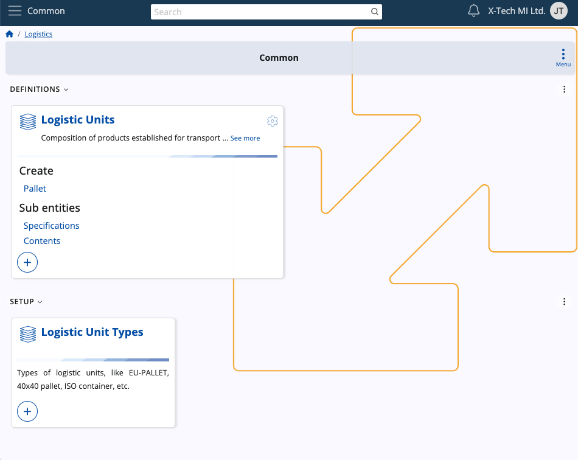

# Logistics

The Logistics module serves as a cornerstone of efficient warehouse management and product availability control within your business infrastructure. It is designed to streamline operations and optimize processes across all aspects of your warehouse operations, offering a comprehensive suite of functionalities.

From procurement to shipment, through inventory control and warehouse management, Logistics offers a robust set of tools and features to meet the demanding needs of your business.

## Structure

Logistics consists of several **submodules** dedicated to the purchase, shipment, delivery and other processes made by warehouses on a daily basis. Most of them allow for the creation and release of respective documents and transactions.

#### Common

This is where you can define and preview **logistical units**, including their **types**, in order to use them across other submodules.

#### Procurement

This is where you can make **purchase orders** for your warehouse.

With the ability to define suppliers, initiate purchase requests, and manage internal requisitions, you gain full control over your procurement processes.

#### Inventory

This submodule offers advanced capabilities and allows for the creation and release of **documents** related to both inventory control and warehouse management.

From defining store locations and making reconciliations to tracking warehouse lots and serial numbers, Inventory provides the tools you need to maintain accurate records and ensure product traceability.

In addition, you can also take advantage of its simplified and intuitive **[Inventory Control](https://docs.erp.net/tech/modules/logistics/inventory/inventory-control/index.html)** application.

#### Shipment

Here, you can streamline the various **shipping** processes initiated by your warehouse. 

By creating shipment orders and transactions, you can effectively coordinate and track the movement of goods from your warehouse to your customers.

#### WMS

The Warehouse Management System works as its own separate module dedicated to the more complex **managed warehouse operations**.

It allows you to create warehouse documents, requisitions and transactions, as well as fulfill orders efficiently using the integrated **[WMS Worker](https://docs.erp.net/tech/modules/logistics/wms/wms-worker/index.html)** application. 

**Learn more about Logistics:**

- **[Common](https://docs.erp.net/tech/modules/logistics/common/index.html)**
- **[Inventory](https://docs.erp.net/tech/modules/logistics/inventory/index.html?q=Inventory)**
- **[Procurement](https://docs.erp.net/tech/modules/logistics/procurement/index.html?q=Procurement)**
- **[Shipment](https://docs.erp.net/tech/modules/logistics/shipment/index.html)**
- **[Warehouse management (WMS)](https://docs.erp.net/tech/modules/logistics/wms/index.html?q=Warehouse%20management%20(WMS))**
- **[Concepts](https://docs.erp.net/tech/modules/logistics/concepts/index.html?q=Common%20concepts)**
- **[Planning concepts and operations](https://docs.erp.net/tech/modules/logistics/planning/index.html?q=Planning)**

> [!NOTE]
> 
> The screenshots taken for this article are from v24 of the platform.
