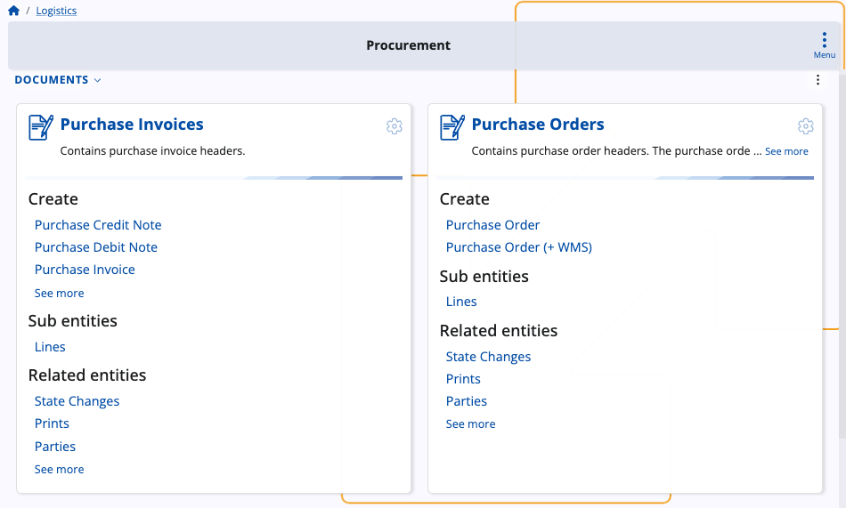

# Logistics

The Logistics module serves as the cornerstone of efficient warehouse management and product availability control within your business infrastructure. It is designed to streamline operations and optimize processes across all aspects of your warehouse operations, providing a comprehensive suite of functionalities.

From procurement to shipment, through inventory control and warehouse management, Logistics offers a robust set of tools and features to meet the demanding needs of your business.

### Structure

Logistics consists of several **submodules** dedicated to the purchase, shipment, delivery and other operations made by warehouses on a daily basis:

#### Common

This is where you can create and preview **logistical units**, including their **types**, in order to use them across other submodules.

#### Procurement

This is where you can monitor material sourcing within your warehouse environment.

With the ability to establish suppliers, initiate purchase requests, and manage internal requisitions, you gain full control over your procurement processes.

#### Inventory

This submodule offers advanced capabilities and documents related to inventory control and warehouse management.

From defining store locations to tracking warehouse lots and serial numbers, Inventory provides the tools you need to maintain accurate records and ensure product traceability.

In addition, you can take advantage of the simplified and intuitive **[Inventory Control](https://docs.erp.net/tech/modules/logistics/inventory/inventory-control/index.html)** application.

#### Shipment

Here, you can streamline various shipping processes for your purchased stocks. 

With features such as generating store orders and transactions, as well as managing shipment orders, you can effectively coordinate and track the movement of goods from your warehouse to your customers.

#### WMS

The **Warehouse Management System** section works as a separate module dedicated to the more complex managed warehouse operations.

It allows you to create warehouse documents, requisitions and orders, as well as fulfill orders efficiently using the integrated **[WMS Worker](https://docs.erp.net/tech/modules/logistics/wms/wms-worker/index.html)** application. 

**Learn more about Logistics:**

- **[Inventory](https://docs.erp.net/tech/modules/logistics/inventory/index.html?q=Inventory)**
- **[Procurement](https://docs.erp.net/tech/modules/logistics/procurement/index.html?q=Procurement)**
- **[Shipment](shipment/index.md)**
- **[Warehouse management (WMS)](https://docs.erp.net/tech/modules/logistics/wms/index.html?q=Warehouse%20management%20(WMS))**
- **[Concepts](https://docs.erp.net/tech/modules/logistics/concepts/index.html?q=Common%20concepts)**
- **[Planning concepts and operations](https://docs.erp.net/tech/modules/logistics/planning/index.html?q=Planning)**

