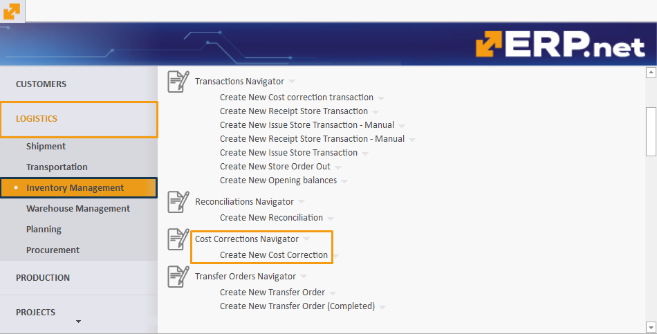
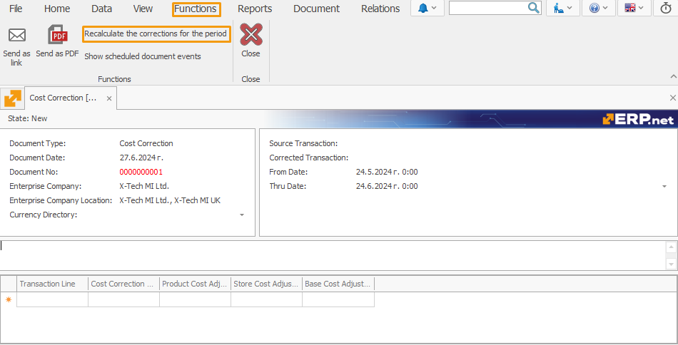
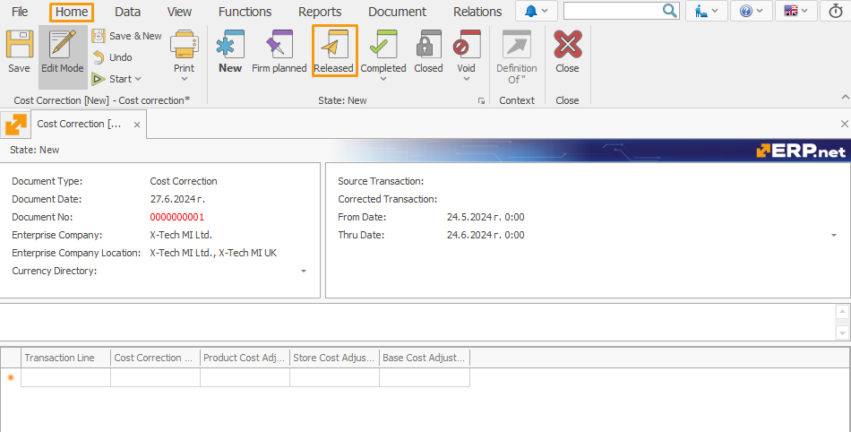
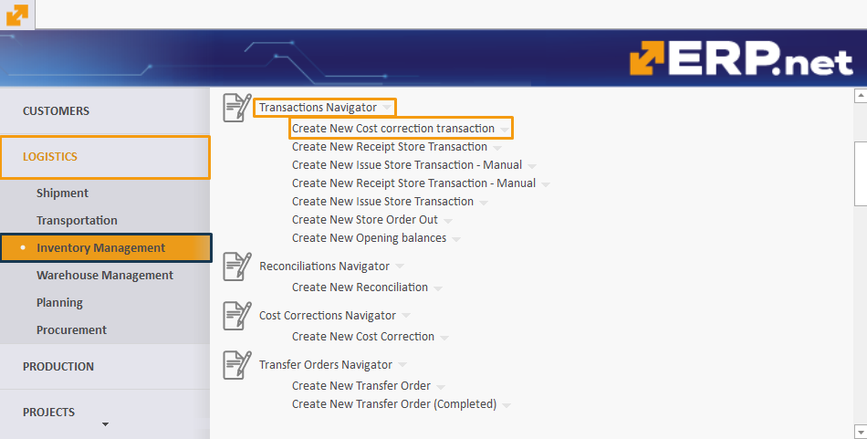
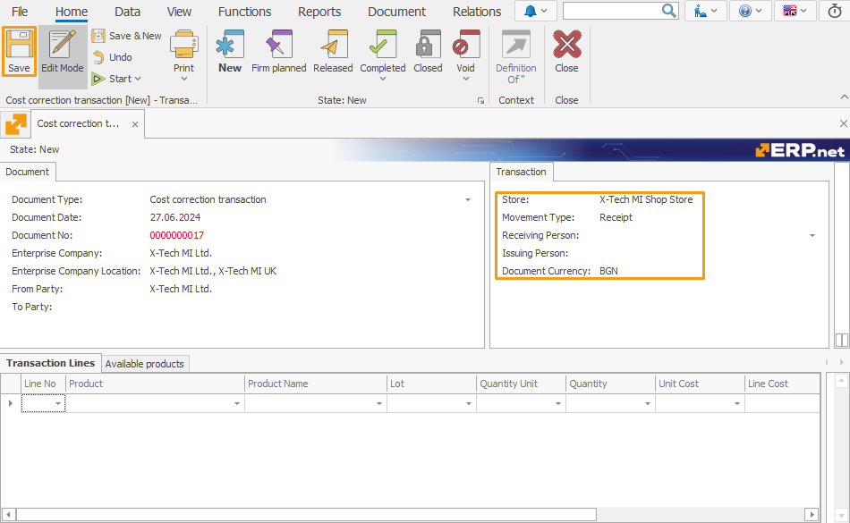
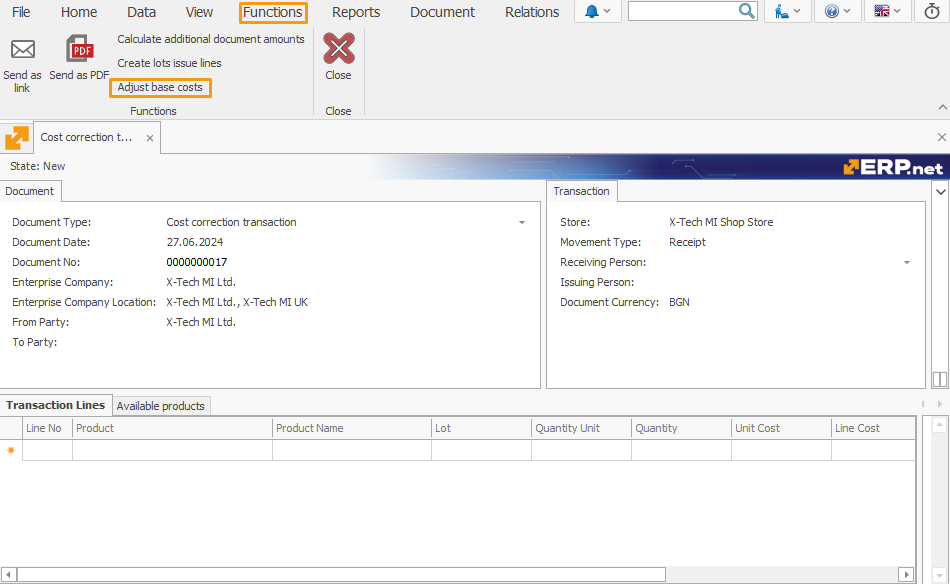
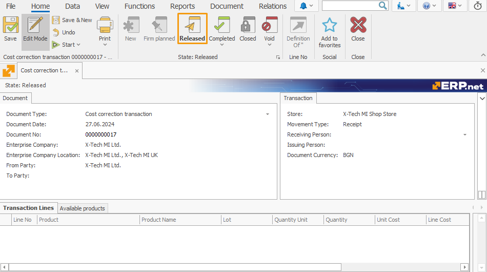

# Adjusted Base Cost

Over time, discrepancies between the base cost and adjusted cost of products can accumulate, leading to inaccuracies in cost data.

The **Adjusted Base Cost** feature aligns **Line Base Cost** with **Base Cost Adjustment**, reducing the need for frequent corrections. 

This is crucial as frequent corrections are labor-intensive and resource-demanding, particularly with increasing database sizes.

## Using Adjusted Base Cost

Here, you'll find detailed steps on how to effectively use the feature.

### Periodic Execution

The **Adjusted Base Cost** feature operates regularly, typically every month. 

This ensures timely adjustments to reflect current inventory conditions following monthly corrections.

### Verifying Base Cost accuracy

To ensure the accuracy of the base cost, performing a cost correction is advisable.

#### Cost Correction

Cost correction adjusts costs over a specified period.

##### Navigation

To initiate a new cost correction:
- Go to **Logistics** -> **Inventory Management** -> **Cost Correction Navigator** -> **Create New Cost Correction**.

##### Creating a Cost Correction

To create a cost correction:
- Fill in the required fields, including the start and end of the period.
- Click **Save**.

- After saving, navigate to **Functions** and select **Recalculate corrections for the period**.

Once prepared:
- Go to **Home** and then **Released** to change the document stage.

- Confirm changing the document status to **Released**.

### Special document type

The next step is creating a document to execute the function, using the **Cost creation transaction** type.

#### Navigation

To create this document:
- Navigate to **Logistics** -> **Inventory Management** -> **Transaction Navigator** -> **Create New Cost creation transaction**.

 

#### Creating a Warehouse Receipt with Cost creation transaction type

Fill in necessary fields such as Store, Movement Type (set as **Receipt**), and Document Currency.
- Click **Save**.

 
After saving:
- Go to **Functions** and click **Adjust base costs**. 

 

The feature calculates variances between **Base Cost** and **Adjusted Cost** for each product within the warehouse, recording the variance in **Base Cost** upon posting the warehouse receipt to align both figures.

- Click **Released** to change the document stage.

 

- Confirm changing the status to **Released**.

A specialized **Cost Source** named **Adjustment** captures and stores values within the **Base Cost** of the warehouse receipt. 

During subsequent adjustments, any recorded discrepancies in **Base Cost** are offset against **Adjusted Cost**, maintaining equilibrium as quantities normalize to zero.
