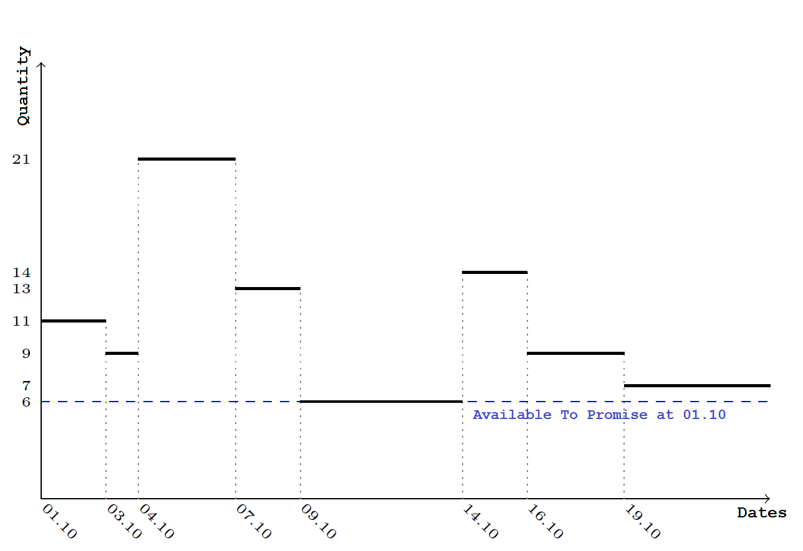

## ATP Algorithm

The current stock holds are added to the unfulfilled store orders chronology. Thus, save for the physical availability, store orders which are not fulfilled, but planned to be on a specific date, are taken into account (the <i>Planned Release Date</i> field indicates this date). Besides physical availability, other already planned stock movements are taken into account.

The calculated quantities for each date from the new chronology are reviewed and the smallest value is selected. This is the ATP quantity for the specified parameters.

We use the smallest value. If on a date when we have the smallest value a greater value is entered as ATP quantity, and this quantity is used for a new issuing operation, it will not be enough for all ordered operations. The minimum quantity in the new chronology actually shows the greatest value we can use for the date specified as a parameter without violating other issuing store processes.

Let’s apply that to the example from [available to promise](https://docs.erp.net/tech/modules/logistics/planning/available-to-promise/index.html?q=Available%20to%20Promise):

After adding the physical availability to the chronology, we have:

|Date|Physical availability|Start quantity|Receipt quantity|Issue quantity|End quantity
|:----:|:----:|:-----:|:----:|:----: |:----: 
|2021/10/01|8| 3|-|-|11               
|2021/10/03|8|-|-|2|9
|2021/10/04|8|-|16|4|21
|2021/10/07|8|-|-|8|13
|2021/10/09|8|-|-|7|6
|2021/10/14|8|-|8|-|14
|2021/10/16|8|-|4|9|9
|2021/10/19|8|-|-|2|7

Here is the graphical chart for the new chronology:

 
After reviewing the value column (or following the lowest values in the graphical chart), you can see that the lowest value is <b>6 pcs</b>. This is the [available to promise](https://docs.erp.net/tech/modules/logistics/planning/available-to-promise/index.html?q=Available%20to%20Promise) quantity for <b>2021/10/01</b>.

## Total clculations (for a period)

When calculating the ATP for a whole period (more than one date), the data gathering, as well as the combination of the chronology and the current stock holds, is executed the way we described earlier. After that, for every date in the period greater than or equal to the date specified as a parameter, the ATP is defined as follows:

1. The minimum quantity value for the whole period is defined - let's call it <b>min1</b>. Then, we pick the last (greatest) date for this value - <b>date1</b>. For every date from the starting to <b>date1</b> (including), the ATP is <b>min1</b>.

2. If there are dates in the chronology after <b>date1</b>, the minimum quantity value for the period after <b>date1</b> is <b>min2</b>. The last date which has this value is <b>date2</b>. From the date after <b>date1</b> and before <b>date2</b> (including), the ATP is <b>min2</b>.

3. This is repeated until all dates in the chronology are covered.

The period we are making calculations for is divided into several sub-periods (at least one, and at most - equal to the number of dates in the chronology). In the first sub-period, there is a minimum value for the ATP. For each subsequent sub-period, the ATP is greater than the ATP for the previous sub-period.

For example, let's have have the following chronology for the period between <b>01.10</b> and <b>06.10</b>, calculated after adding the current physical availability to the data from the unexecuted sore oders.

|Date|Physical availability|Start quantity|Receipt quantity|Issue quantity|End quantity
|:----:|:----:|:-----:|:----:|:----: |:----: 
|2021/10/01|12|8|-|-|20               
|2021/10/03|12|-|2|-|22
|2021/10/08|12|-|5|-|27
|2021/10/09|12|-|2|19|10
|2021/10/12|12|-|-|7|3
|2021/10/15|12|-|28|6|25
|2021/10/16|12|-|-|7|18
|2021/10/20|12|-|6|9|15
|2021/10/21|12|-|-|3|12
|2021/10/24|12|-|24|5|31
|2021/10/30|12|-|-|6|25
|2021/10/31|12|-|-|5|20

After reviewing the chronology, we establish that the period from <b>2021/10/01</b> to <b>2021/10/06</b> is divided to three sub-periods: one from <b>2021/10/01</b> to <b>2021/10/14</b>, another from <b>2021/10/15</b> to <b>2021/10/23</b> and a third from <b>2021/10/24</b> to <b>2021/11/06</b>. For the first period, the minimum value (hence the ATP) is <b>3 pcs</b>. For the second period, it is <b>12 pcs</b>, and for the last period, the ATP is <b>20 pcs</b>. 

These calculations are represented by a graphic:

 
## Modifications in the agorithm iplementation

There are some specific changes in the ATP calculation for algorithm implementation. When using the unexecuted store orders chronology instead of starting with an opening balance for a defined period, the definition of the start quantity for the unexecuted stre oders is not really effective. All store movements - the unexecuted by now store orders - are used without limits for date and without calculation for the starting value. These movements calculate the ATP for sub-periods. To calculate the ATP for a specific date, we simply take into account the periods before this date and the minimum value from the last period.

This method is effective enough. However, problems appear when we want to calculate the ATP for a date before all existing unexecuted store orders. There is no sore oders chronology for this date and as the opening balance is not calculated (it would be zero), the previously mentioned principle for ATP calculation cannot be applied.

When the date for which we calculate the ATP is before the earliest unexecuted store orders,the following principle is applied:

1. All unexecuted store orders after the specified date are taken into account, and the ATP is calculated according to their chronology. This is a value [projected available balance](https://docs.erp.net/tech/modules/logistics/planning/projected-available-balance.html?q=Projected%20Available%20Balance).
2. The current available physical quantity is calculated - value [<b>Current Stock Holds</b>]

3. If there are future unexecuted store orders, (i.e., if [[projected available balance](https://docs.erp.net/tech/modules/logistics/planning/projected-available-balance.html?q=Projected%20Available%20Balance)]  is not null), then: 
 
[<b>ATP</b>] = min([[projected available balance](https://docs.erp.net/tech/modules/logistics/planning/projected-available-balance.html?q=Projected%20Available%20Balance)], [<b>Current Stock Holds</b>])

4. Otherwise, [<b>ATP</b>] = [<b>Current Stock Holds</b>]

For example, if the current physical availability is <b>10 pcs</b> and there are the following unexecuted Store Orders:

- 2021/10/09 - <b>2 pcs</b>, receipt;

- 2021/10/13 - <b>7 pcs</b>, issue;

- 2021/10/16 - <b>6 pcs</b>, receipt.

the ATP for the dates from <b>2021/10/09</b> to <b>2021/10/15</b> (including) is <b>5 pcs</b>. After this date, it is <b>11 pcs</b>.

 If we have the same data from the previous example, but the issue for <b>2021/10/13</b> is <b>1 pcs</b>, then the ATPs would be as follows:
 
- before <b>2021/10/09: 10 pcs</b> (this is the smaller value from the current physical availability and the [projected available balance](https://docs.erp.net/tech/modules/logistics/planning/projected-available-balance.html?q=Projected%20Available%20Balance) after <b>2021/10/09</b>);

- from <b>2021/10/09</b> to <b>2020/10/15</b> (including): <b>11 pcs</b>;

- from <b>2021/10/16</b> onward: <b>17 pcs</b>.

