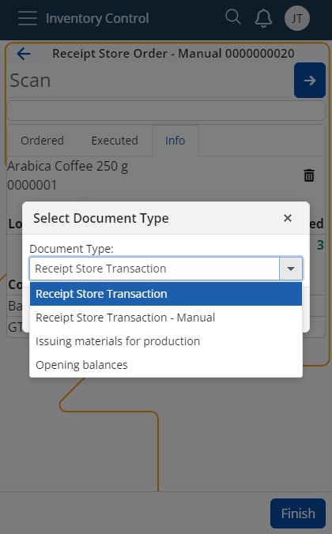

# Use the Document Type from Routes to create a new document

If certain conditions are met, it is possible to create new documents through **[Inventory Control](../inventory-control/index.md)** by taking in mind both the Document Type specified in the **[Settings](../inventory-control/settings.md)** as well as the Document Type defined in the **Document Routes** for the respective order.

This applies to the **[Receive](../inventory-control/receive.md)** and **[Issue](../inventory-control/issue.md)** operations, providing more flexibility when defining the final documents they can generate.

## Step-by-step process

1. Perform a validation check for the receive/issue store order by **filtering** the following fields in the *Document TypesFormRoutings* panel of the _StoreOrders_ data type:

   - **ProcessEvent**: Must be "Change of state".
   - **ConditionStatesBitMask**: Must include "Released".
   - **Destination DocumentType**: Must be a document of data type "Transactions".

     When the store order is created, the Route’s activity must fit within the period specified in the *ActivationDate* and *DeactivationDate* fields. Keep in mind that these fields may be empty.
   
   - **IsActive**: Must be "True".
   - **ConditionEnterpriseCompany**: Must match the *StoreOrder.EnterpriseCompany* or be empty.
   - **AllowedGenerationTypes**: Must be set to "Only Manually".

2. Once the filtering procedure is over, you need to **extract** information about the **Document Type** from the remaining **routes**.

3. Keeping in mind the **results** of the validation check as well as the **Document Type** specified in the **Inventory Control Settings**, you can encounter the following situations:
   
   - **No** valid result is returned from the Document Routes and **no** Document Type is specified in the Inventory Control Settings for the receive or issue function.

     => An error will be thrown: "*No document type selected*".

   - **No** valid result is returned from the Document Routes but a Document Type **is** specified in the Inventory Control Settings for the receive or issue function.

     => A store order of the respective type will be created based on what is provided in the Settings.

   - **Only one** valid result is returned from the Document Routes (or **multiple** valid results all pointing to **the same** Document Type)

     => A Document Type is selected **regardless** of what is specified in the Inventory Control Settings.

   - **Multiple different** results are returned from the Document Routes

     => A **selection menu** is displayed with a dropdown list containing all returned results from the Document Routes plus the Document Type specified in the Inventory Control Settings.
  
     

     The dropdown list will have a **default** value, determined as follows:
               
        - If at least **one** of the returned results **matches** the Document Type specified in the Inventory Control Settings, that Document Type is chosen as the default.
          
        - If **none** of the returned results match the Document Type specified in the Inventory Control Settings, or if no Document Type is specified in these Settings, the default value is the Document Type with the smallest **Code** value among the routes (*DocumentType.Code*).

> [!NOTE]
> 
> The screenshots taken for this article are from v24 of the platform.
