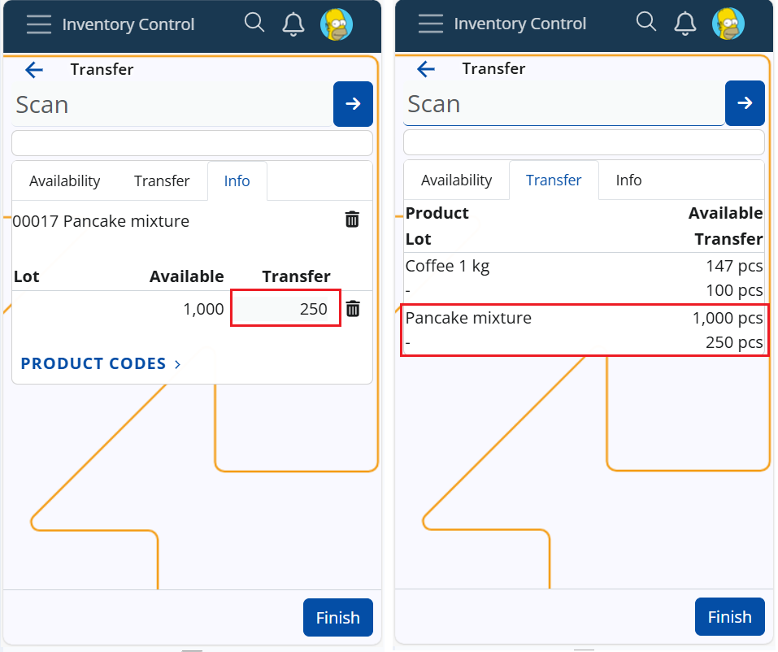

# **How to edit quantity**

For the sake of accuracy, efficiency, and flexibility in inventory operations, workers can **edit the executed quantity** at operations Receive, Issue, Scrap, Transfer, and Quick Reconcile.
Whether due to scanning errors, miscounts, or handling variations in products with lots and variants it is necessary to do on-the-go corrections directly during execution, eliminating the need for later adjustments in the Store transaction. Here is a detailed instruction on how to perform the corrections.

## Key details
* the editable field is accesible in tab Info only
* it is light-grey
* the edit is performed in a pop-up box
* the box is supplied with up/down keys plus you can input digits from the keyboard as well
* the edit needs confirmation
* multiple edits are possible

## Perform a quantity edit at operations Receive, Issue, Transfer or Scrap 

When any quantity is scanned it enters the designated field - executed, transfer, scrap. Only the quantity field in tab Info is editable.

Let say you transfer 500pcs of product X. You realize you need to correct the quantity to 250pcs.

  
**Steps:**

    1. Navigate to tab Info of product X
    2. Click in the light-grey quantity field that contains "500"
        -> a pop-up edit-box will appear
    3. Enter the correct quantity "250" from the keyboard or use the down arrow
    4. Confirm with "Ok"

**Result:**

    1. The new quantity is saved in the field
    2. The field in tab Transfer is edited too
    3. The quantity can be edited until a Transfer Order is created with button Finish

  

