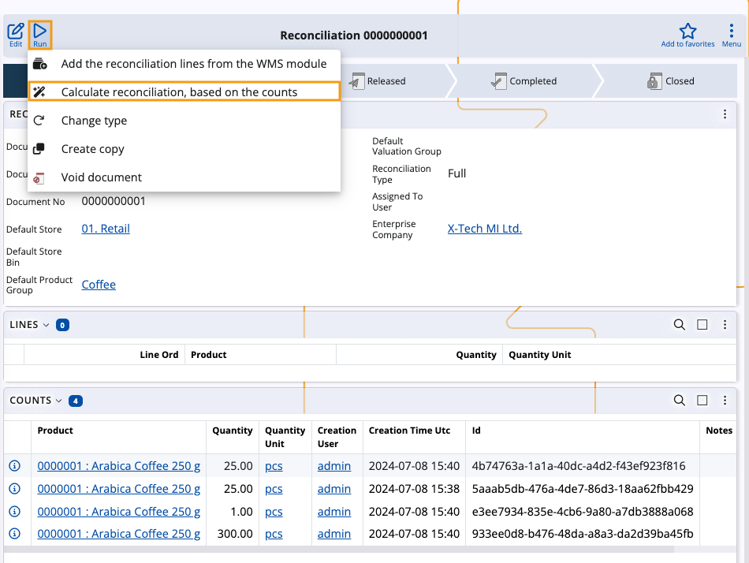
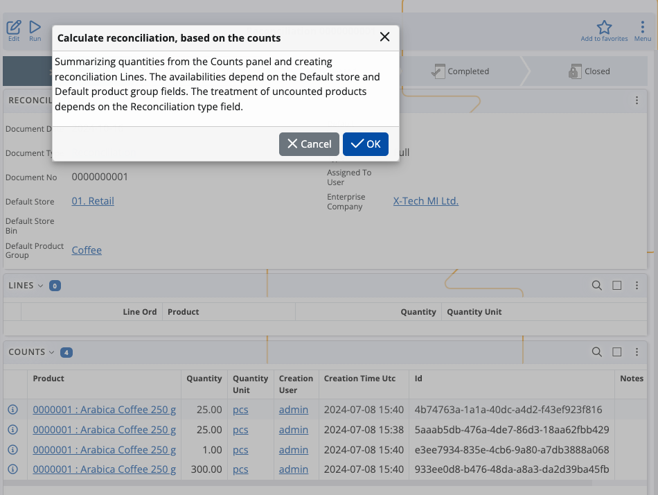

# Calculate reconciliation based on the counts

The **Calculate reconciliation, based on the counts** function takes the rows of product quantities counted in the **Counts** panel of a reconciliation order and summarizes them into lines in the **Lines** panel.

For instance: 

1. There are six rows of counted quantities of the same product in the **Counts** panel.

2. The function is run. 

3. All rows are summarized into a single line in the **Lines** panel.

> [!WARNING]
> It is not possible to run the function if:  
> * a **Default Store** and a **Reconciliation Type** are not specified for the document
> * the document is in a state **higher than or equal to** Released   
> * counted products belong to a product group and/or a store **different** from the **Default Product Group** and the **Default Store**

### Lines data

Once product quantities from the Counts panel are summarized into lines, the following information is revealed for each line:

* **Product** - the product whose quantities are counted

* **Quantity** - a sum of the product's counted quantities, grouped by product

* **QuantityUnit** - the measurement unit of the product

* **AvailableQuantityBase** - the current product availability, filtered by Default Store and Default Product Group 

* **Store** - the store to which the product belongs.

### Behavior based on Reconciliation type

Depending on the **Reconciliation type** of the document, the function behaves in one of two ways:

**Partial** 

Lines are created for **all** counted products and filled with the respective lines data.

Products that are not counted **don't have** lines created for them and their current availability will not be changed.
  
**Full**

Lines are created for **all** counted products and filled with the respective lines data.

Products that are not counted will **have** lines created for them with quantities set to "0".

> [!NOTE]
> Products that are counted but are not part of the current store's availability will still have lines created for them, where **AvailableQuantityBase will be equal to 0**. 

### Behavior based on zero counts

Depending on whether zero quantities are present in the **Counts** panel, the function behaves in one of two ways:

1. **There's at least one** counted zero quantity of a product as well as other quantities different from zero.

   In this scenario, all quantities of the same product are **summed** in the Lines panel. 
  
2. **The only** counted quantity for one or more products is zero.

   In this scenario, each product that has a zero quantity counted will get a line in the Lines panel with quantity set to **"0"**.

> [!NOTE]
> Lines for zero quantities are created **only** for products that are not counted and have **the same** store and product group as the Default Store and Default Product Group of the reconciliation order.  
> If a product is available in a different store or belongs to a different product group, **no line will be created for it**.

## Execute the function

1. Open a reconciliation order, click on the **Run** button and select **Calculate reconciliation, based on the counts**

   

   You will be asked to confirm the execution of the function. Click **OK**.

   

2. If all conditions are met, new product lines will be created in the **Lines** panel of the reconciliation order.
